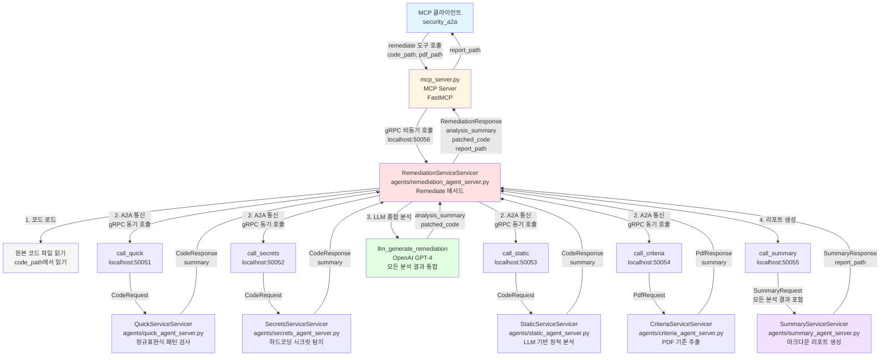
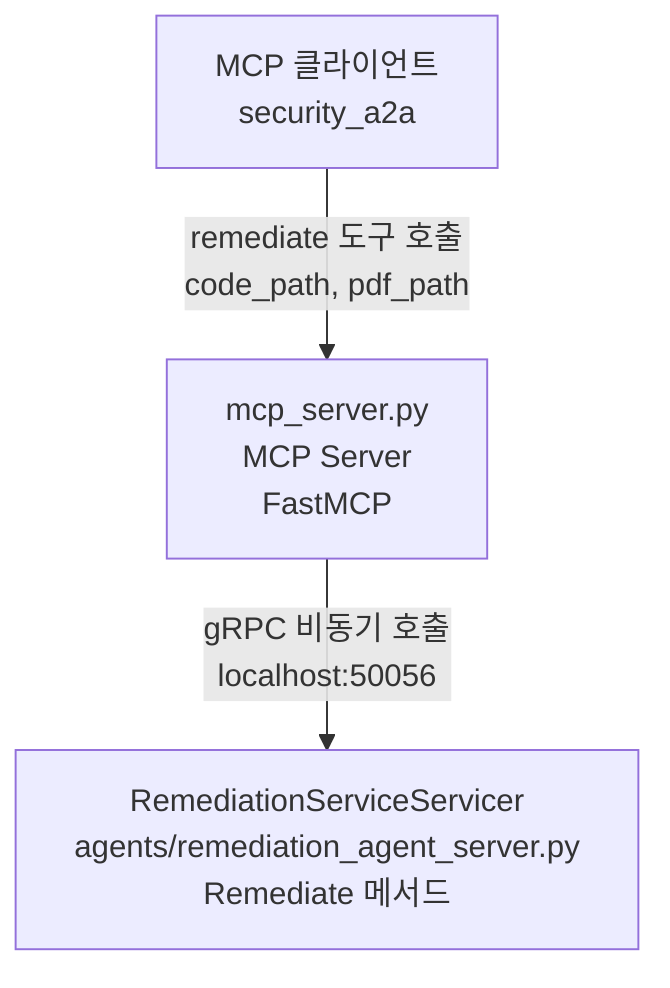
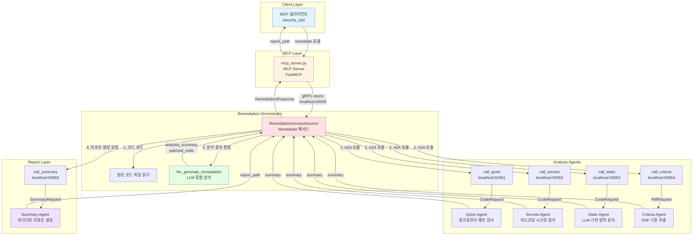

# Mermaid flowchart 생성법

> **카테고리**: `Algorithms (알고리즘 & 자료구조)`  
> **원천**: ChatGPT 대화 아카이브 (`raw/notes/Chatgpt_2026-08-02-23-14-23`)  
> **작성일**: 2026-05-12

## 💬 대화 내용 및 Q&A

### 💡 답변 (Assistant)
좋습니다. 지금 작성하신 코드는 **Mermaid flowchart 문법**입니다. 즉, 별도의 그림 툴 없이도 Markdown, VS Code, GitHub, Notion 일부 환경, Mermaid Live Editor 등에서 바로 플로우차트로 렌더링할 수 있습니다.

가장 쉬운 방법은 아래처럼 Markdown 파일에 넣는 것입니다.

````markdown

````

## 1. 가장 간단한 확인 방법: Mermaid Live Editor

브라우저에서 **Mermaid Live Editor**에 들어가서, 작성한 코드를 왼쪽에 붙여넣으면 오른쪽에 바로 다이어그램이 나옵니다.

사용 흐름은 이렇습니다.

```text
Mermaid 코드 작성
→ Mermaid Live Editor에 붙여넣기
→ PNG / SVG / PDF로 export
→ 발표자료나 문서에 삽입
```

이 방법이 가장 빠릅니다.

---

## 2. VS Code에서 보는 방법

VS Code에서 Markdown 파일을 하나 만듭니다.

예를 들어:

```text
architecture.md
```

그 안에 아래처럼 작성합니다.

````markdown
# Remediation Agent Workflow


````

그다음 VS Code에서 Markdown Preview를 열면 됩니다.

단축키는 보통:

```text
Ctrl + Shift + V
```

또는 우측 상단의 Preview 버튼을 누르면 됩니다.

단, VS Code 기본 Markdown Preview에서 Mermaid가 바로 안 보일 수 있습니다. 그럴 때는 확장 프로그램을 설치하면 됩니다.

추천 확장:

```text
Markdown Preview Mermaid Support
```

설치 후 다시 Preview를 열면 Mermaid 차트가 렌더링됩니다.

---

## 3. GitHub README에서 표현하기

GitHub는 Mermaid를 지원합니다. 그래서 `README.md`에 아래처럼 넣으면 바로 그림으로 보입니다.

````markdown
## 시스템 워크플로우


````

즉, 프로젝트 구조 설명용으로는 `README.md`에 넣는 방식이 아주 좋습니다.

---

## 4. 현재 코드에서 개선하면 좋은 점

지금 코드도 거의 그대로 사용 가능합니다. 다만 노드가 많고 선이 복잡해서, 실제 발표용이나 문서용으로는 **서브그래프**를 쓰는 게 더 보기 좋습니다.

예를 들어 이렇게 정리할 수 있습니다.



이 버전은 구조가 훨씬 명확합니다.

핵심 계층이 이렇게 나뉩니다.

```text
Client Layer
→ MCP Layer
→ Remediation Orchestrator
→ Analysis Agents
→ Report Layer
```

문서나 발표에서는 이 방식이 더 좋습니다.

---

## 5. 방향 바꾸기

현재는 위에서 아래로 흐르는 구조입니다.

```mermaid
flowchart TD
```

여기서 `TD`는 **Top Down**입니다.

다른 방향도 가능합니다.

```text
TD: 위 → 아래
LR: 왼쪽 → 오른쪽
RL: 오른쪽 → 왼쪽
BT: 아래 → 위
```

발표자료에서는 보통 왼쪽에서 오른쪽으로 흐르는 게 더 보기 좋습니다.

```mermaid
flowchart LR
```

즉, 맨 첫 줄만 이렇게 바꾸면 됩니다.

```mermaid
flowchart LR
```

---

## 6. 추천 사용 방식

지금 같은 시스템 아키텍처 설명이면 저는 이렇게 추천합니다.

```text
README.md / 기술문서용 → Mermaid 그대로 사용
발표 PPT용 → Mermaid Live Editor에서 SVG로 export
보고서 PDF용 → SVG 또는 PNG로 저장 후 삽입
개발 중 구조 공유 → GitHub README에 mermaid 코드 삽입
```

결론적으로, 지금 작성하신 코드는 이미 Mermaid flowchart 형식입니다.  
가장 실용적인 방법은 **Markdown 파일에 ```mermaid 코드블록으로 넣거나, Mermaid Live Editor에 붙여넣어서 이미지로 내보내는 것**입니다.

---

### ❓ 질문 (User)
```
flowchart TD
    A[MCP 클라이언트<br/>security_a2a] -->|remediate 도구 호출<br/>code_path, pdf_path| B[mcp_server.py<br/>MCP Server<br/>FastMCP]
    B -->|gRPC 비동기 호출<br/>localhost:50056| C[RemediationServiceServicer<br/>agents/remediation_agent_server.py<br/>Remediate 메서드]
    
    C -->|1. 코드 로드| D[원본 코드 파일 읽기<br/>code_path에서 읽기]
    
    C -->|2. A2A 통신<br/>gRPC 동기 호출| E1[call_quick<br/>localhost:50051]
    C -->|2. A2A 통신<br/>gRPC 동기 호출| E2[call_secrets<br/>localhost:50052]
    C -->|2. A2A 통신<br/>gRPC 동기 호출| E3[call_static<br/>localhost:50053]
    C -->|2. A2A 통신<br/>gRPC 동기 호출| E4[call_criteria<br/>localhost:50054]
    
    E1 -->|CodeRequest| F1[QuickServiceServicer<br/>agents/quick_agent_server.py<br/>정규표현식 패턴 검사]
    E2 -->|CodeRequest| F2[SecretsServiceServicer<br/>agents/secrets_agent_server.py<br/>하드코딩 시크릿 탐지]
    E3 -->|CodeRequest| F3[StaticServiceServicer<br/>agents/static_agent_server.py<br/>LLM 기반 정적 분석]
    E4 -->|PdfRequest| F4[CriteriaServiceServicer<br/>agents/criteria_agent_server.py<br/>PDF 기준 추출]
    
    F1 -->|CodeResponse<br/>summary| C
    F2 -->|CodeResponse<br/>summary| C
    F3 -->|CodeResponse<br/>summary| C
    F4 -->|PdfResponse<br/>summary| C
    
    C -->|3. LLM 종합 분석| G[llm_generate_remediation<br/>OpenAI GPT-4<br/>모든 분석 결과 통합]
    G -->|analysis_summary<br/>patched_code| C
    
    C -->|4. 리포트 생성| H[call_summary<br/>localhost:50055]
    H -->|SummaryRequest<br/>모든 분석 결과 포함| I[SummaryServiceServicer<br/>agents/summary_agent_server.py<br/>마크다운 리포트 생성]
    I -->|SummaryResponse<br/>report_path| C
    
    C -->|RemediationResponse<br/>analysis_summary<br/>patched_code<br/>report_path| B
    B -->|report_path| A
    
    style A fill:#e1f5ff
    style B fill:#fff4e1
    style C fill:#ffe1e1
    style G fill:#e1ffe1
    style I fill:#f0e1ff
    style D fill:#f5f5f5
```
이걸 flowchart로 표현하고 싶은데 방법 알려줘

### 💡 답변 (Assistant)
좋아요. Mermaid와 같은 “텍스트/구조 기반 다이어그램”부터, 직접 드래그해서 그리는 웹앱까지 나눠서 추천해볼게요. 시스템 아키텍처/워크플로우 표현에 맞는 쪽으로 골라드리겠습니다.

---

### 💡 답변 (Assistant)
네, Mermaid 말고 비슷한 역할을 하는 웹앱이면 아래 쪽이 많이 쓰입니다. 지금 작성하신 **MCP/gRPC/Agent 워크플로우** 같은 시스템 구조도 기준으로 추천드리면 이렇습니다.

## 1. diagrams.net / draw.io

가장 무난한 추천입니다.

웹에서 바로 쓰고, 박스/화살표를 직접 배치할 수 있습니다. Mermaid처럼 코드 기반은 아니지만, 시스템 아키텍처나 플로우차트 그릴 때 정말 많이 씁니다. Google Drive, OneDrive, GitHub, 로컬 파일 저장도 지원합니다. 무료 오픈소스 계열 도구로 소개되는 경우가 많고, 웹/데스크톱 모두 사용할 수 있습니다. citeturn422574search4turn422574search6

추천 상황:

```text
발표자료용 그림
제안서용 시스템 아키텍처
비개발자도 같이 볼 구조도
```

지금 다이어그램을 예쁘게 정리하려면 **diagrams.net**이 제일 현실적입니다.

---

## 2. Excalidraw

손그림 느낌의 다이어그램 웹앱입니다.

정확한 UML보다는 “아이디어 구조”, “시스템 흐름”, “화이트보드 설명”에 좋습니다. 개발 회의나 프로젝트 제안서 초안에 잘 어울립니다. 최근 AI/개발자용 다이어그램 도구 비교에서도 Excalidraw가 많이 언급됩니다. citeturn422574search0

추천 상황:

```text
팀 회의용
초기 설계도
아키텍처 아이디어 설명
화이트보드 느낌의 발표
```

단점은 정밀한 정렬이나 공식 문서 스타일은 draw.io보다 약합니다.

---

## 3. Eraser

개발자용 아키텍처 다이어그램 웹앱입니다.

이름이 기억나던 게 혹시 **Eraser**일 수도 있습니다. 텍스트로 다이어그램을 만들거나, AI로 구조도를 생성하는 쪽에 특화되어 있습니다. 소프트웨어 아키텍처, ERD, 시퀀스 다이어그램, 클라우드 구조도 같은 개발 문서에 잘 맞습니다.

추천 상황:

```text
개발자용 시스템 설계 문서
아키텍처 다이어그램
AI로 초안 생성 후 수정
```

Mermaid보다 “웹앱스럽고”, draw.io보다 “개발자 문서화”에 가까운 느낌입니다.

---

## 4. PlantUML

Mermaid와 가장 비슷한 **텍스트 기반 다이어그램 도구**입니다.

Mermaid보다 오래됐고, UML 계열 표현력이 좋습니다. 특히 시퀀스 다이어그램, 클래스 다이어그램, 컴포넌트 다이어그램에 강합니다. Red Hat도 PlantUML과 Mermaid를 diagrams-as-code 모델의 도구로 설명합니다. citeturn422574search10

추천 상황:

```text
시퀀스 다이어그램
UML
클래스/컴포넌트 관계
문서와 코드처럼 버전 관리
```

지금 구조를 “서비스 간 호출 흐름”으로 표현한다면 Mermaid보다 **PlantUML sequence diagram**이 더 적합할 수도 있습니다.

---

## 5. D2

Mermaid 대체로 꽤 괜찮은 최신 텍스트 기반 다이어그램 도구입니다.

문법이 비교적 깔끔하고, 시스템 아키텍처 다이어그램에 잘 맞습니다. “Diagram as Code” 도구로 Mermaid, PlantUML, Graphviz, D2 등이 함께 언급됩니다. citeturn422574search9turn422574search11

추천 상황:

```text
텍스트로 아키텍처 관리
Git으로 버전 관리
Mermaid 문법이 답답할 때
```

---

## 6. Structurizr

소프트웨어 아키텍처를 제대로 설계하려면 가장 전문적인 쪽입니다.

C4 Model 기반으로 시스템 컨텍스트, 컨테이너, 컴포넌트 다이어그램을 관리할 수 있습니다. Structurizr DSL 하나로 여러 다이어그램을 생성하고, PlantUML/Mermaid로 export할 수도 있습니다. citeturn422574search13

추천 상황:

```text
기업연계 프로젝트 아키텍처 문서
C4 Model 기반 설계
시스템/컨테이너/컴포넌트 구조 분리
```

지금 프로젝트처럼 `MCP Server`, `Remediation Agent`, `Quick/Secrets/Static/Criteria Agent`, `Summary Agent`가 나뉘는 구조라면 Structurizr도 잘 맞습니다.

---

## 7. Kroki

이건 웹앱이라기보다는 **여러 다이어그램 문법을 이미지로 렌더링해주는 서비스/API**에 가깝습니다.

PlantUML, Mermaid, Graphviz, D2 등 여러 형식을 한 곳에서 처리할 수 있습니다. Kroki 공식 설명에 따르면 HTTP API로 텍스트 기반 다이어그램을 생성할 수 있고, POST로 plain text를 보낼 수도 있습니다. citeturn422574search1

추천 상황:

```text
문서 자동 생성
CI/CD에서 다이어그램 이미지 생성
여러 다이어그램 문법을 한 번에 처리
```

---

## 제일 추천하는 선택

지금 목적이 **워크플로우를 예쁘게 표현**하는 거라면:

```text
1순위: diagrams.net / draw.io
2순위: Excalidraw
3순위: Eraser
```

지금 목적이 **코드처럼 관리 가능한 다이어그램**이라면:

```text
1순위: PlantUML
2순위: D2
3순위: Structurizr
```

지금 작성하신 MCP + gRPC + Agent 구조는 개인적으로 이렇게 추천합니다.

```text
README / 개발문서용: Mermaid, PlantUML, D2
발표자료 / 제안서용: diagrams.net
초기 설계 회의용: Excalidraw
기업 프로젝트 아키텍처 문서용: Structurizr
```

제가 보기에는 지금 상황에서는 **diagrams.net(draw.io)** 또는 **Eraser**가 가장 잘 맞습니다. 특히 기업연계 프로젝트 제안서나 발표자료에 넣을 목적이면 **draw.io로 박스/계층 구조를 직접 정리하는 방식**이 제일 깔끔합니다.

---

### ❓ 질문 (User)
mermaid 말고 비슷한 역할 하는 웹앱 있었던거 같은데 추천해줘
