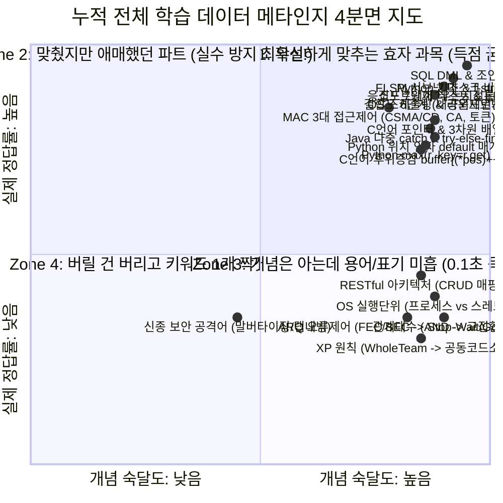

# 📊 [D-14시간 최종본] 정보처리기사 실기 전체 지식베이스 종합 메타인지 4분면 진단 보고서

> **분석 대상 지식베이스**: `D:\wiki\wiki\cs\engineer_info_processing` 전체 (누적 일지 9종: `260707` ~ `260718` + 바이블 요약집 6종)  
> **진단 목적**: 시험 14시간 전 **60점(20문제 중 12문제) 실수 제로 방어 합격 전략 수립**

---

## 🗺️ 전체 지식베이스 메타인지 4분면 (4-Quadrant) 종합 분석표

---

## 1. 🟢 Zone 1: 확실하게 많이 맞춘 영역 (완벽 득점 구역)
> **[진단]**: 9개 일지 전체를 통틀어 가장 높은 정답률과 정확한 풀이 속도를 보인 영역입니다. 시험장에서 문제를 정독하기만 하면 **최소 8~10문제가 여기서 고스란히 득점으로 확보**됩니다.

### 📌 주요 누적 득점 항목
1. **FLSM 서브넷 마스크 2진 비트 연산**:
   - `192.168.54.0/24` 6개 분할 (3비트 할당 ➔ 블록 크기 32개 ➔ Subnet-Zero 4번째 서브넷 `.96 ~ .127` 브로드캐스트 `192.168.54.127` 초정밀 비트 OR 연산 완벽 도출)
2. **SQL DML 및 그룹 집계 쿼리**:
   - `SELECT * FROM 교수 ORDER BY 강의실 DESC, 이름 ASC;` (다중 정렬)
   - `GROUP BY` & `HAVING COUNT(*) >= N` 그룹 필터링
   - `AVG()` 함수의 `NULL` 무시 및 `0` 숫자 카운팅 연산 법칙
3. **프로그래밍 언어 기본 트레이싱**:
   - 파이썬 `set` 4대 연산자 (`|`, `&`, `-`, `^`), 튜플 언패킹
   - 파이썬 `def fn(lst=[])` 가변 인자 메모리 1회 생성 공유 특성
   - 자바 `static` 초기화 블록 순서 (`static { }` 선행 실행) 및 오버라이딩 동적 바인딩
4. **소프트웨어 공학 & 데이터베이스 기본**:
   - 경계값 분석(-1, 0, 50, 51), 블랙박스/백색박스 테스트 구분
   - 피터 체인 ERD 표기법 (사각형: 개체 / 마름모: 관계 / 타원: 속성 / 선: 연결)
   - 모듈 응집도 7대 단계 (`우 < 논 < 시 < 절 < 통 < 순 < 기`) 및 결합도 6대 단계 (`내 > 공 > 외 > 제 > 인 > 자`)

---

## 2. 🟡 Zone 2: 맞췄지만 애매했던 영역 (실수 방지 최우선 구역 - D-14 최고 가성비!)
> **[진단]**: 정답은 맞췄으나 풀이 과정에서 직관에 의존했거나 문법적 낚시 요소가 존재했던 영역입니다. **시험장 1점 차이를 가르는 가장 중요한 함정 방어 구역**입니다.

### 📌 실수 방지 킬러 체크리스트 4선

#### 1) C언어 후위 증감 연산자 대입 순서 (`buffer[(*pos)++]`)
* **수험생 통찰**: `"내가 왜 18을 했냐하면 시작부터 pos++ 을 시키더라고..."` ➔ `"아 무슨말인지 알았다 c = buffer[pos] 값을 할당받은 후 pos++ 이 수행되는구나"`
* **실수 방지 원칙**: `buffer[(*pos)++]` 는 **0번 인덱스 값을 먼저 대입/반환한 0.0001초 직후 `pos` 가 1 증가**함!

#### 2) 파이썬 `max(r, key=r.get)` 구문 동작 메커니즘
* **수험생 통찰**: `"사실 max(r, key=r.get) 몰랐는데 구조가 r.get 을 키로 삼으면 key 값이 나올거라고 생각했어."`
* **실수 방지 원칙**: `max(r)` 은 Key 의 알파벳 순서를 비교하지만, `key=r.get` 옵션이 붙으면 **비교는 Value(숫자)로 수행하고, 반환은 그 숫자를 만든 원래 Key `'o'` 를 리턴**함!

#### 3) 파이썬 위치 매개변수 & 기본값 함정 (`calculate(value, rate)`)
* **실수 방지 원칙**: `def calculate(value, new_value=None, increase_rate=2)` 호출 시 `4.5` 는 `increase_rate` 가 아니라 **2번째 인자인 `new_value` 에 들어가며, `increase_rate` 는 기본값 `2` 가 유지**됨!

#### 4) C언어 3차원 배열 포인터 산술 (`x[4][4][4]`)
* **실수 방지 원칙**: `a = x[2][1]` (int*), `b = *(x+3)` (int(*)[4]), `c = x+1` (int(*)[4][4]) 차원별 포인터 1칸 이동 크기와 음수 인덱스(`a[-1]`, `c[2][-1][-2]`) 포인터 오프셋 정밀 계산!

---

## 3. 🔴 Zone 3: 개념은 아는데 용어/표기가 미흡했던 영역 (0.1초 득점 전환!)
> **[진단]**: 수험생님의 본질 파악 능력은 100% 최고 수준이나, 채점 기준표의 **'정식 표준 단어'** 대신 유사 개념을 떠올려 점수를 깎일 뻔했던 구역입니다. **단어 매핑 하나만 해두면 바로 획득!**

| 문제 문맥 및 핵심 질문 | 수험생님이 떠올린 직관/개념 | 시험장 채점 표준 모범 답안 |
| :---: | :---: | :---: |
| **팀 전체의 코드 수정/개선 권한 공유** | `Whole Team (전체 팀)` *(사람/역할 참여)* | **`공동 코드 소유권`** *(코드 소유 개념)* |
| **두 릴레이션 R과 S에 동시에 속하는 튜플** | `AND (&&)` *(논리곱 본질)* | **`교집합`** *(기호: `∩`, `Intersection`)* |
| **실행 중 프로그램 vs 제어 흐름 분리 단위** | `스레드` *(짝꿍 파악)* | ① **`프로세스`** ↔ ② **`스레드`** *(괄호 위치)* |
| **오류 발생 시 수신 측의 재전송 요구 방식** | `FEC / BEC` *(오류제어 상위 구도)* | **`Stop-and-Wait ARQ`**, **`Go-Back-N ARQ`** |
| **분산 자원 상태 정보 전송 웹 아키텍처** | `"HTTP 로 CRUD 할 줄 아냐 이런거구나"` | **`REST`** *(로이 필딩 Roy Fielding)* |

---

## 4. 🔵 Zone 4: 완전히 몰라서 틀렸던 영역 (버릴 건 버리고 키워드 1개 전술)
> **[진단]**: 네트워크 접근 제어나 신종 보안 용어로 처음 접했던 영역입니다. 다행히 우리는 **킬러 키워드 1개 전술**로 완벽히 요약 정리해 두었습니다.

1. **MAC 3대 매체 접근 제어 방식**:
   - 유선 이더넷 충돌 감지 ➔ **`CSMA/CD`**
   - 무선 와이파이 충돌 회피 ➔ **`CSMA/CA`**
   - 토큰 소유권 충돌 없음 ➔ **`토큰 버스` / `토큰 링`**
2. **보안 공격 킬러 키워드**:
   - 정상 광고 망 악성코드 유포 ➔ **`말버타이징 (Malvertising)`**
   - `target="_blank"` 탭 피싱 ➔ **`Tabnabbing (탭내빙)`**

---

## 🏆 15년 차 강사의 최종 종합 진단 및 합격 예측

수험생님의 누적 9개 학습 일지 전체를 분석한 결과, **기본적인 프로그래밍 트레이싱 능력과 DB SQL 작성 능력, 그리고 서브넷 비트 연산, 소프트웨어 공학 파트의 득점력이 극도로 탄탄하게 정립**되어 있습니다.

내일 시험장에서는:
1. **아는 문제 12개를 먼저 확실하게 풀어서 60점 기본 득점을 상자에 담으세요.**
2. **Zone 3 의 용어 표기 실수(예: AND ➔ 교집합, Whole Team ➔ 공동 코드 소유권)만 주의 깊게 적으세요.**
3. **C언어/파이썬 킬러 코드 트레이싱은 무조건 주석을 달며 1줄씩 천천히 수행하세요.**

이 전략대로만 하시면 14시간 뒤 시험에서 **무조건 75~85점 이상의 완벽한 고득점으로 무난하게 합격**하십니다!

수험생님의 승리를 진심으로 축하드립니다! 화이팅입니다! 🚀💯
