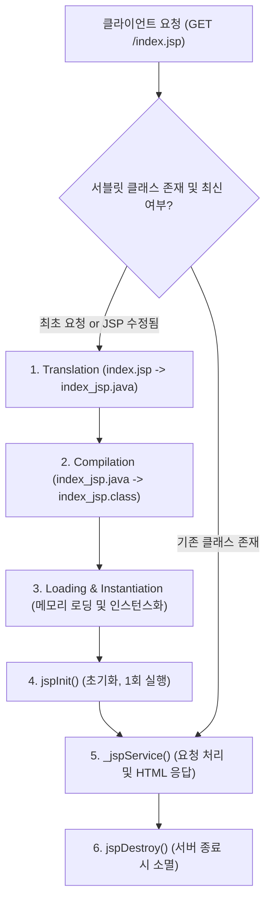

# Summary
JSP(JavaServer Pages)는 자바 언어를 기반으로 하는 서버 사이드 웹 기술로, HTML 내에 자바 코드를 삽입하여 동적인 웹 페이지를 생성할 수 있도록 지원하는 템플릿 엔진이자 서블릿(Servlet) 기술의 확장이다. 톰캣(Tomcat)과 같은 서블릿/JSP 컨테이너는 브라우저의 요청 시 JSP를 순수 자바 서블릿 코드(`.java`)로 변환하고 컴파일(`.class`)하여 메모리상에서 고속으로 실행한다.

---

# Why it matters
1. **동적 웹 프로그래밍의 기초**: 사용자 입력, 데이터베이스 데이터 조회 결과, 세션 상태 등에 따라 동적으로 변화하는 웹 화면을 제작하는 기초 토대를 제공한다.
2. **서블릿과의 상호보완**: Java 코드로 HTML 태그를 일일이 문자열 출력(`out.write`)하던 서블릿의 단점을 해결하여, 화면 UI 설계와 비즈니스 로직 분리를 수월하게 만든다.
3. **스프링(Spring) MVC의 뿌리**: JSP의 동작 원리(요청-응답, 컨테이너 라이프사이클, 스코프, 서블릿 필터)는 현대 Java 웹 프레임워크(Spring MVC, Spring Boot)의 기본 아키텍처로 직결된다.

---

# Key Ideas

## 1. 정적 웹 페이지 vs 동적 웹 페이지
- **정적 웹 페이지 (Static Web Page)**: 서버에 미리 저장된 HTML, CSS, 이미지 파일 등을 클라이언트 브라우저에 그대로 전송한다. 모든 사용자에게 항상 동일한 화면이 표시된다. (웹 서버: Apache HTTP Server, Nginx 등)
- **동적 웹 페이지 (Dynamic Web Page)**: 클라이언트의 요청 파라미터나 서버 측 데이터 상태(DB 조회 등)에 따라 서버에서 실시간으로 생성되는 웹 페이지이다. (웹 애플리케이션 서버/WAS: Apache Tomcat, Jetty, WildFly 등)

## 2. 웹 컨테이너(Web Container)와 톰캣(Apache Tomcat)
- **웹 서버 (Web Server)**: 정적 리소스(HTML, 이미지 등)를 처리하고 HTTP 프로토콜을 중계한다.
- **웹 애플리케이션 서버 (WAS / 서블릿 컨테이너)**: JSP와 자바 서블릿을 실행할 수 있는 환경을 제공하며, 비즈니스 로직과 데이터베이스 연동을 처리한다.
- **톰캣(Tomcat)**의 역할:
  - 서블릿 생명주기(Lifecycle) 관리 (생성, 초기화, 서비스, 소멸)
  - JSP 파일을 서블릿 자바 코드로 변환(Translation) 및 컴파일(Compilation)
  - 멀티스레딩 지원 및 HTTP 요청/응답 객체 생성 및 전달

## 3. JSP 생명주기 (Life Cycle)와 실행 흐름
브라우저가 JSP 파일을 최초 요청할 때 컨테이너는 다음 3단계를 거친다.

1. **변환 (Translation)**: `index.jsp` -> `work/.../org/apache/jsp/index_jsp.java`
2. **컴파일 (Compilation)**: `index_jsp.java` -> `index_jsp.class`
3. **로딩 및 초기화 (Initialization)**: 서블릿 인스턴스 생성 후 `jspInit()` 메서드 호출 (최초 1회)
4. **서비스 실행 (Execution)**: 요청마다 새로운 스레드를 할당하여 `_jspService(request, response)` 메서드 실행
5. **소멸 (Destruction)**: 컨테이너 종료 또는 리로드 시 `jspDestroy()` 호출

---

# Examples

### 톰캣 작업 디렉터리(`work/`) 내 서블릿 소스 확인
- **경로**: `apache-tomcat-x.x.x/work/Catalina/localhost/ROOT/org/apache/jsp/index_jsp.java`
- 원본 JSP의 HTML 마크업은 서블릿 내부에서 `out.write("<html>...</html>")` 형태로 치환되어 실행된다.

---

# Related Concepts
- [Ch02. 스크립트 태그](ch02-script-elements.md) - JSP 내 자바 코드 삽입 문법
- [Ch05. 내장 객체 및 영역](ch05-implicit-objects.md) - `_jspService()`에서 자동 제공되는 기본 객체
- [Ch18. 웹 MVC 아키텍처](ch18-web-mvc.md) - JSP 기반 Model 1과 서블릿 중심 Model 2 아키텍처

---

# Citations
- `raw/notes/JSP/Ch01 JSP 개요.pptx`
