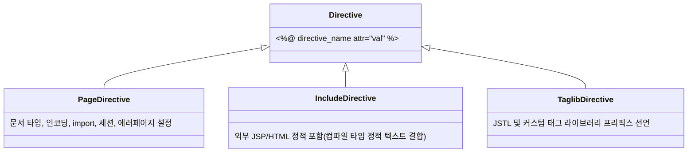

# Summary
디렉티브 태그(Directive Tag)는 JSP 컨테이너가 해당 JSP 페이지를 자바 서블릿으로 변환할 때 필요한 **페이지 설정 정보와 처리 지침**을 전달하는 특수 태그이다. `<%@ directive attribute="value" %>` 형태를 가지며 `page`, `include`, `taglib`의 3가지 유형이 제공된다.

---

# Why it matters
1. **문서 인코딩 및 Content-Type 제어**: 한글 깨짐 방지(`UTF-8`)와 MIME 타입 설정을 결정한다.
2. **자바 패키지 Import**: 자바 클래스(`java.util.*`, `java.sql.*` 등)를 JSP 내에서 사용 가능하게 바인딩한다.
3. **코드 재사용과 모듈화**: 헤더/푸터 공통 컴포넌트를 `include` 디렉티브로 컴파일 타임에 결합한다.

---

# Key Ideas

## 1. 디렉티브 3대 유형



## 2. page 디렉티브 주요 속성
- `contentType="text/html; charset=UTF-8"`: 브라우저로 전송되는 응답 데이터의 MIME 타입과 문자 인코딩 설정.
- `pageEncoding="UTF-8"`: JSP 소스 파일 자체의 저장 인코딩 지정.
- `import="java.util.List, java.util.ArrayList"`: 자바 클래스 import (유일하게 중복 기술 가능).
- `session="true|false"`: `HttpSession` 내장 객체 자동 생성 여부 (기본값: `true`).
- `errorPage="error.jsp"`: 예외 발생 시 포워딩할 에러 페이지 지정.
- `isErrorPage="true|false"`: 현재 페이지가 에러 처리 페이지인지 선언 (true 시 `exception` 내장 객체 활성화).

## 3. include 디렉티브 (`<%@ include file="header.jsp" %>`)
- **컴파일 시점(Translation Time)의 정적 결합**: 원본 JSP가 서블릿 자바 파일로 변환되기 전에 포함할 파일의 소스 코드가 그대로 복사되어 단일 `.java` 파일로 컴파일된다.
- **액션 태그(`jsp:include`)와의 차이**:
  - `include 디렉티브`: 컴파일 타임 정적 포함, 변수 공유 가능, 단일 서블릿 생성.
  - `jsp:include 액션 태그`: 런타임 동적 포함, 요청 제어권 위임, 각각 별도 서블릿으로 실행 후 출력 결과만 병합.

## 4. taglib 디렉티브
- JSTL(JSP Standard Tag Library)이나 사용자 정의 태그를 사용할 때 URI와 prefix를 연결한다.
- 예: `<%@ taglib prefix="c" uri="http://java.sun.com/jsp/jstl/core" %>`

---

# Examples

```jsp
<%@ page language="java" contentType="text/html; charset=UTF-8" pageEncoding="UTF-8"%>
<%@ page import="java.util.Date, java.text.SimpleDateFormat" %>
<%@ page errorPage="errorHandling.jsp" %>
<%@ taglib prefix="c" uri="http://java.sun.com/jsp/jstl/core" %>

<!DOCTYPE html>
<html>
<head><title>Directive Example</title></head>
<body>
    <!-- 공통 헤더 정적 포함 -->
    <%@ include file="common/header.jsp" %>

    <%
        Date now = new Date();
        SimpleDateFormat sdf = new SimpleDateFormat("yyyy-MM-dd HH:mm:ss");
    %>
    <h3>현재 서버 시각: <%= sdf.format(now) %></h3>

    <!-- 공통 푸터 정적 포함 -->
    <%@ include file="common/footer.jsp" %>
</body>
</html>
```

---

# Related Concepts
- [Ch02. 스크립트 태그](ch02-script-elements.md) - JSP 내 스크립트 요소
- [Ch04. 액션 태그](ch04-action-tags.md) - 동적 포함(`jsp:include`)과의 메커니즘 차이
- [Ch17. JSTL & EL](ch17-jstl-el.md) - `taglib` 디렉티브를 통한 JSTL 활용

---

# Citations
- `raw/notes/JSP/Ch03 디렉티브 태그.pptx`
