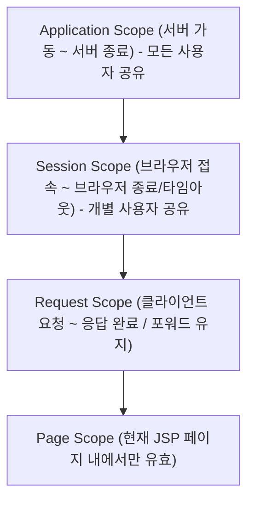

# Summary
내장 객체(Implicit Objects)는 개발자가 별도로 객체를 생성하지 않아도 JSP 컨테이너가 `_jspService()` 메서드 내에 미리 선언하고 초기화해 두어 **즉시 사용할 수 있는 9개의 내장 자바 객체**이다. 이 객체들은 각각의 생명주기와 유효 범위를 나타내는 **4대 영역(page, request, session, application)**에 매핑되어 상태를 보관하고 공유한다.

---

# Why it matters
1. **HTTP 프로토콜 제어**: 클라이언트의 헤더, 요청 파라미터, 쿠키 정보 조회 및 응답 헤더, 리다이렉트(`sendRedirect`) 처리를 수행한다.
2. **웹 애플리케이션 상태 유지**: Stateless한 HTTP 환경에서 요청 간(Request), 사용자 단위(Session), 애플리케이션 전체(Application) 상태를 바인딩하여 공유한다.

---

# Key Ideas

## 1. JSP 9대 내장 객체 일람

| 내장 객체명 | 실제 자바 타입 | 주요 역할 및 기능 |
| :--- | :--- | :--- |
| `request` | `javax.servlet.http.HttpServletRequest` | 클라이언트의 HTTP 요청 정보(파라미터, 헤더, 쿠키, URI 등) 조회 |
| `response` | `javax.servlet.http.HttpServletResponse` | HTTP 응답 정보 설정(헤더, 쿠키 추가, 리다이렉트 `sendRedirect`) |
| `out` | `javax.servlet.jsp.JspWriter` | 응답 출력 스트림에 문자열/HTML 마크업 출력 |
| `session` | `javax.servlet.http.HttpSession` | 동일 클라이언트 브라우저의 상태 유지 및 세션 데이터 관리 |
| `application` | `javax.servlet.ServletContext` | 웹 애플리케이션 전체의 전역 컨텍스트 및 공용 자원 관리 |
| `pageContext` | `javax.servlet.jsp.PageContext` | 현재 JSP 페이지의 실행 환경 및 다른 모든 내장 객체에 대한 접근점 제공 |
| `page` | `java.lang.Object` (현재 서블릿 인스턴스 `this`) | 현재 JSP 서블릿 인스턴스 자신 |
| `config` | `javax.servlet.ServletConfig` | 서블릿의 초기화 파라미터(`web.xml`) 조회 |
| `exception` | `java.lang.Throwable` | 발생한 예외 객체 (`isErrorPage="true"`인 페이지에서만 활성화) |

## 2. 웹 애플리케이션 4대 유효 영역 (Scope)



| Scope | 대응 내장 객체 | 공유 범위 | 생명주기 (Lifecycle) |
| :--- | :--- | :--- | :--- |
| **Page** | `pageContext` | 현재 페이지 내부 | 요청된 단일 JSP 페이지가 실행되는 동안만 유효 |
| **Request** | `request` | 요청을 처리하는 동안 (포워드 포함) | 클라이언트 요청 시작부터 응답이 전송될 때까지 유효 |
| **Session** | `session` | 동일 클라이언트의 모든 요청 | 웹 브라우저가 열려 세션이 유지되는 동안 유효 |
| **Application** | `application` | 웹 애플리케이션의 모든 사용자 | WAS 서버가 시작되어 종료될 때까지 전역 유효 |

## 3. Scope 공통 데이터 바인딩 메서드
4대 내장 객체는 모두 다음 공통 메서드를 통해 Key-Value 형태의 데이터를 저장하고 조회한다:
- `setAttribute(String name, Object value)`: 속성 저장
- `getAttribute(String name)`: 속성 조회 (Object 반환, 형변환 필요)
- `removeAttribute(String name)`: 속성 삭제
- `getAttributeNames()`: 모든 속성 이름 목록 열거

---

# Examples

```jsp
<%@ page language="java" contentType="text/html; charset=UTF-8" pageEncoding="UTF-8"%>
<%
    // 1. 요청 파라미터 읽기
    String userName = request.getParameter("userName");
    
    // 2. 세션에 사용자 로그인 정보 저장
    if (userName != null) {
        session.setAttribute("loginUser", userName);
    }
    
    // 3. 애플리케이션 전역 방문자 수 증가
    Integer totalHits = (Integer) application.getAttribute("totalHits");
    if (totalHits == null) {
        totalHits = 1;
    } else {
        totalHits++;
    }
    application.setAttribute("totalHits", totalHits);
%>

<!DOCTYPE html>
<html>
<head><title>Scope Example</title></head>
<body>
    <p>현재 접속자: <%= session.getAttribute("loginUser") %></p>
    <p>전체 사이트 누적 조회수: <%= application.getAttribute("totalHits") %></p>
    <p>클라이언트 IP: <%= request.getRemoteAddr() %></p>
</body>
</html>
```

---

# Related Concepts
- [Ch01. JSP 개요](ch01-overview.md) - 컨테이너가 `_jspService()`에 내장 객체를 생성하는 원리
- [Ch13. 세션](ch13-session.md) - `session` 객체를 통한 로그인 및 상태 유지 상세
- [Ch18. 웹 MVC](ch18-web-mvc.md) - `request.setAttribute()`를 이용한 Controller → View 데이터 전달

---

# Citations
- `raw/notes/JSP/Ch05 내장 객체.pptx`
