# Summary
파일 업로드는 클라이언트의 로컬 파일(이미지, 문서, 바이너리 등)을 웹 서버로 전송하여 저장하는 기술이다. 일반 폼 전송과 달리 `<form enctype="multipart/form-data" method="POST">` 형식을 사용해야 하며, 서버 측에서는 **COS 라이브러리(`MultipartRequest`)**나 **Apache Commons FileUpload** 컴포넌트를 사용하여 멀티파트 스트림을 파싱한다.

---

# Why it matters
1. **바이너리 데이터의 안전한 전송**: 텍스트 외에 이미지, 동영상, 압축 파일 등의 바이너리 데이터를 청크 단위로 분할 전송한다.
2. **보안 및 서버 자원 관리**: 파일 크기 제한(Max File Size), 허용 확장자 필터링, 파일명 중복 시 정책(`DefaultFileRenamePolicy`) 수립을 통해 서버 오동작 및 악성코드 업로드를 차단한다.

---

# Key Ideas

## 1. 파일 업로드 필수 3대 전제조건
- `<form>` 태그의 `method` 속성은 반드시 **`POST`**여야 한다.
- `<form>` 태그의 `enctype` 속성은 반드시 **`multipart/form-data`**여야 한다.
- 파일 선택을 위한 `<input type="file" name="...">` 태그를 포함해야 한다.

## 2. COS 라이브러리 (`com.oreilly.servlet.MultipartRequest`)
`cos.jar` 라이브러리가 제공하는 `MultipartRequest` 클래스는 파일 업로드를 가장 간결하게 처리할 수 있는 유틸리티 객체이다.

```mermaid
flowchart LR
    Form["<form enctype='multipart/form-data'>"] -->|HTTP POST 전송| Server["톰캣 서버"]
    Server -->|파싱 & 디스크 저장| MR["new MultipartRequest(...)"]
    MR --> Save["1. 지정 폴더에 물리 파일 자동 저장"]
    MR --> Param["2. 일반 파라미터 & 원본/저장 파일명 추출"]
```



### MultipartRequest 생성자 매개변수
```java
MultipartRequest multi = new MultipartRequest(
    request,            // HttpServletRequest 객체
    saveDirectory,      // 서버 내 파일 저장 디렉터리 경로
    maxPostSize,        // 최대 파일 크기 (바이트 단위)
    "UTF-8",            // 파일명 및 파라미터 인코딩
    new DefaultFileRenamePolicy() // 파일명 중복 시 자동 넘버링 정책 (예: file1.png)
);
```

### MultipartRequest 주요 메서드
- `getParameter(String name)`: 일반 텍스트 폼 파라미터 값 추출 (`request.getParameter` 대신 사용)
- `getOriginalFileName(String name)`: 사용자가 업로드한 원본 파일 이름 반환
- `getFilesystemName(String name)`: 서버 디스크에 실제 저장된 파일 이름 반환 (중복 시 변경된 이름)
- `getContentType(String name)`: 업로드된 파일의 MIME 타입 반환

---

# Examples

### 파일 업로드 처리 (`fileUploadProcess.jsp`)
```jsp
<%@ page language="java" contentType="text/html; charset=UTF-8" pageEncoding="UTF-8"%>
<%@ page import="com.oreilly.servlet.MultipartRequest" %>
<%@ page import="com.oreilly.servlet.multipart.DefaultFileRenamePolicy" %>
<%@ page import="java.io.File" %>

<%
    // 1. 실제 서버 디렉터리 경로 획득
    String uploadPath = application.getRealPath("/uploads");
    File dir = new File(uploadPath);
    if (!dir.exists()) dir.mkdirs();

    // 2. 최대 파일 크기 설정 (10MB)
    int maxSize = 10 * 1024 * 1024;

    // 3. MultipartRequest 객체 생성과 동시에 파일 저장 수행
    MultipartRequest multi = new MultipartRequest(
        request,
        uploadPath,
        maxSize,
        "UTF-8",
        new DefaultFileRenamePolicy()
    );

    // 4. 파라미터 및 파일 메타정보 추출
    String description = multi.getParameter("description");
    String originalName = multi.getOriginalFileName("uploadFile");
    String filesystemName = multi.getFilesystemName("uploadFile");
    String contentType = multi.getContentType("uploadFile");
%>

<!DOCTYPE html>
<html>
<head><title>Upload Complete</title></head>
<body>
    <h3>파일 업로드 성공</h3>
    <p>설명: <%= description %></p>
    <p>원본 파일명: <%= originalName %></p>
    <p>서버 저장 파일명: <%= filesystemName %></p>
    <p>파일 타입: <%= contentType %></p>
</body>
</html>
```

---

# Related Concepts
- [Ch06. 폼 태그](ch06-form-processing.md) - Form 속성 및 GET/POST 전송 방식
- [Ch08. 유효성 검사](ch08-validation.md) - 파일 확장자 및 용량 유효성 검사
- [Ch10. 시큐리티](ch10-security.md) - 악성 파일 업로드 공격 방어

---

# Citations
- `raw/notes/JSP/Ch07 파일 업로드.pptx`
