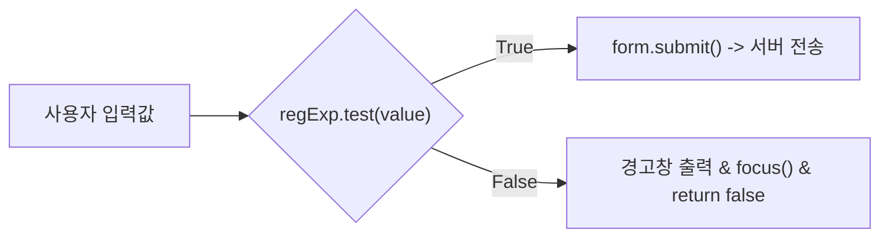

# Summary
유효성 검사(Validation)는 사용자가 폼에 입력한 데이터가 서버로 전송되기 전에 **형식, 길이, 필수 입력 여부, 데이터 유효 범위 등을 사전에 검증하는 절차**이다. 클라이언트 측 자바스크립트 유효성 검사를 통해 서버의 불필요한 부하를 줄이고 데이터 무결성을 보장한다.

---

# Why it matters
1. **서버 자원 및 네트워크 대역폭 보호**: 잘못된 형식의 요청이 서버로 전송되는 것을 사전에 차단하여 불필요한 서버 연산과 왕복(Round-trip) 지연을 줄인다.
2. **보안 공격 방어**: SQL Injection, XSS 등의 특수문자 삽입을 입력 단계에서 정규 표현식으로 필터링한다.
3. **사용자 경험(UX) 개선**: 입력 오류 발생 시 즉각적인 피드백과 포커스 이동을 제공한다.

---

# Key Ideas

## 1. 기본 유효성 검사 (Basic Validation)
자바스크립트 DOM API를 이용하여 입력값의 존재 유무, 길이, 숫자 여부 등을 판별한다.
- `document.formName.fieldName.value == ""` : 필수 입력 필드 누락 검사
- `isNaN(value)` : 숫자 형식 여부 판별
- `element.focus()` : 오류가 발생한 입력 필드로 포커스 이동
- `element.select()` : 입력값 자동 블록 지정

## 2. 정규 표현식 (Regular Expression, RegExp) 기반 검사
복잡한 문자 패턴(이메일, 주민번호, 비밀번호 복잡도, 전화번호 등)을 정규식 객체를 통해 검증한다.



### 주요 정규 표현식 메타 문자
- `^` / `$` : 문자열의 시작 / 끝
- `[0-9]` 또는 `\d` : 숫자
- `[a-zA-Z]` : 영문 대소문자
- `[가-힣]` : 한글 완성형
- `{n,m}` : 최소 n자 이상, 최대 m자 이하
- `+` / `*` : 1회 이상 반복 / 0회 이상 반복

---

# Examples

### 자바스크립트 + 정규표현식 검증 예제
```html
<!DOCTYPE html>
<html>
<head>
<meta charset="UTF-8">
<title>Validation Example</title>
<script type="text/javascript">
function checkForm() {
    var form = document.memberForm;

    // 1. 아이디 검사: 영문자로 시작하고 영문/숫자 조합 4~12자
    var regExpId = /^[a-zA-Z][a-zA-Z0-9]{3,11}$/;
    if (!regExpId.test(form.userId.value)) {
        alert("아이디는 영문자로 시작하는 4~12자의 영문/숫자여야 합니다.");
        form.userId.focus();
        return false;
    }

    // 2. 이메일 형식 검사
    var regExpEmail = /^[0-9a-zA-Z]([-_\.]?[0-9a-zA-Z])*@[0-9a-zA-Z]([-_\.]?[0-9a-zA-Z])*\.[a-zA-Z]{2,3}$/i;
    if (!regExpEmail.test(form.email.value)) {
        alert("올바른 이메일 형식을 입력하세요.");
        form.email.focus();
        return false;
    }

    // 3. 검증 통과 시 전송
    form.submit();
}
</script>
</head>
<body>
    <form name="memberForm" action="registerProcess.jsp" method="POST">
        아이디: <input type="text" name="userId"><br>
        이메일: <input type="text" name="email"><br>
        <input type="button" value="가입하기" onclick="checkForm()">
    </form>
</body>
</html>
```

---

# Related Concepts
- [Ch06. 폼 태그](ch06-form-processing.md) - Form 파라미터 전송
- [Ch10. 시큐리티](ch10-security.md) - 서버 사이드 입력값 검증과 웹 보안

---

# Citations
- `raw/notes/JSP/Ch08 유효성 검사.pptx`
