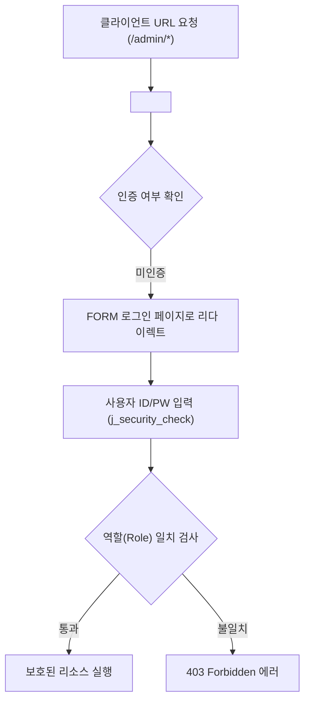

# Summary
웹 시큐리티(Web Security)는 인가되지 않은 사용자의 불법 접근으로부터 시스템 자원을 보호하는 기술이다. 서블릿/JSP 환경에서는 배치 설명자(`web.xml`)에 접근 제어 규칙을 선언하는 **선언적 보안(Declarative Security)**과 자바 서블릿 API를 통해 세밀하게 권한을 제어하는 **프로그래밍적 보안(Programmatic Security)**의 두 가지 방식을 제공한다.

---

# Why it matters
1. **인증(Authentication)과 인가(Authorization)의 분리**: 사용자의 신원을 확인하는 인증과 리소스 접근 자격을 검사하는 인가를 체계적으로 구현한다.
2. **코드 변경 없는 보안 정책 수립**: `web.xml` 설정을 통해 비즈니스 소스 코드 수정 없이 특정 URL 패턴에 대한 역할(Role) 기반 접근 제한을 일괄 적용할 수 있다.

---

# Key Ideas

## 1. 선언적 보안 (Declarative Security in `web.xml`)



### `web.xml` 3대 핵심 보안 설정 태그
1. `<security-constraint>`: 보호할 웹 리소스 컬렉션(`url-pattern`, `http-method`)과 허용할 역할(`auth-constraint/role-name`)을 정의.
2. `<login-config>`: 인증 방식(`BASIC`, `DIGEST`, `FORM`, `CLIENT-CERT`)과 로그인/에러 페이지 매핑 지정.
   - FORM 인증 표준 Form Action: `action="j_security_check"`
   - 파라미터 표준명: `name="j_username"`, `name="j_password"`
3. `<security-role>`: 애플리케이션 전반에서 사용할 보안 역할(Role) 이름을 선언.

## 2. 프로그래밍적 보안 (Programmatic Security API)
`HttpServletRequest` 객체가 제공하는 메서드를 통해 JSP/서블릿 코드 내에서 동적으로 권한을 검사한다:
- `request.getRemoteUser()`: 인증된 사용자의 아이디(username) 반환
- `request.isUserInRole(String role)`: 현재 사용자가 특정 권한(Role)을 보유하고 있는지 boolean 판별
- `request.getUserPrincipal()`: 인증 주체(`java.security.Principal`) 객체 반환

---

# Examples

### `web.xml` 선언적 보안 설정
```xml
<web-app>
    <!-- 1. 보안 제약조건: /admin/* 경로는 ADMIN 역할만 접근 허용 -->
    <security-constraint>
        <web-resource-collection>
            <web-resource-name>AdminZone</web-resource-name>
            <url-pattern>/admin/*</url-pattern>
            <http-method>GET</http-method>
            <http-method>POST</http-method>
        </web-resource-collection>
        <auth-constraint>
            <role-name>ADMIN</role-name>
        </auth-constraint>
    </security-constraint>

    <!-- 2. FORM 기반 로그인 설정 -->
    <login-config>
        <auth-method>FORM</auth-method>
        <form-login-config>
            <form-login-page>/login.jsp</form-login-page>
            <form-error-page>/loginError.jsp</form-error-page>
        </form-login-config>
    </login-config>

    <!-- 3. 역할 정의 -->
    <security-role>
        <role-name>ADMIN</role-name>
    </security-role>
</web-app>
```

---

# Related Concepts
- [Ch12. 서블릿 필터](ch12-filter.md) - 필터 기반 커스텀 인증/인가 처리
- [Ch13. 세션](ch13-session.md) - 세션 기반 로그인 인증 구현

---

# Citations
- `raw/notes/JSP/Ch10 시큐리티.pptx`
