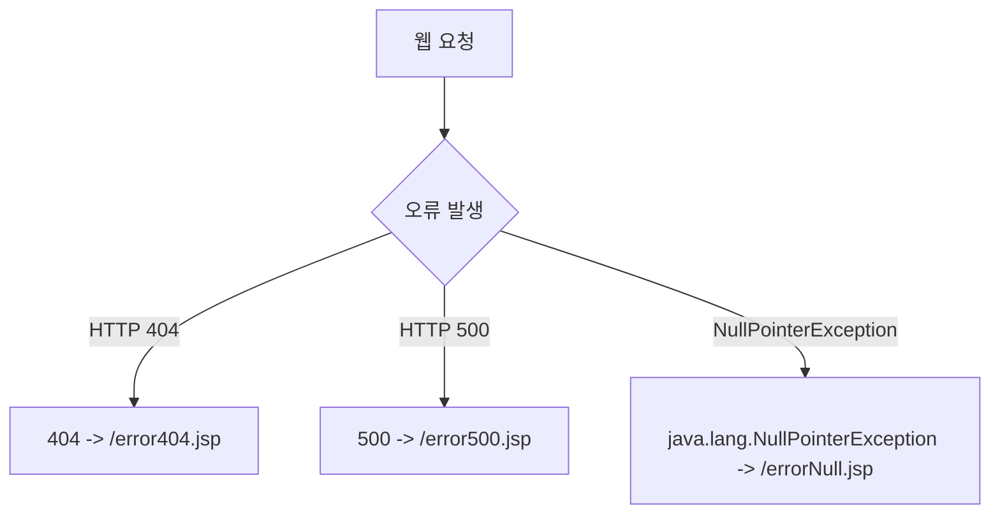

# Summary
JSP 웹 애플리케이션에서 발생하는 예외(Exception)와 런타임 오류는 사용자에게 톰캣 기본 에러 화면(스택 트레이스)으로 노출될 경우 심각한 보안 취약점과 불쾌한 사용자 경험을 유발한다. JSP는 **`page` 디렉티브**와 **`web.xml` 배치 설명자**를 통해 오류를 가로채어 친절한 사용자 정의 에러 페이지로 리다이렉트/포워딩하는 메커니즘을 제공한다.

---

# Why it matters
1. **보안 정보 노출 차단**: 시스템 구조, DB 테이블명, 소스코드 라인 번호가 포함된 스택 트레이스 노출을 차단한다.
2. **안정적인 서비스 운영**: 404(Not Found), 500(Internal Server Error) 등의 오류 발생 시 일관된 네비게이션과 안내 페이지를 제공한다.

---

# Key Ideas

## 1. JSP Page 디렉티브 기반 예외 처리
- **오류 발생 페이지**: `<%@ page errorPage="myErrorPage.jsp" %>`
  - 페이지 내에서 처리되지 않은 예외가 발생하면 즉시 지정된 에러 페이지로 포워딩된다.
- **에러 전용 페이지**: `<%@ page isErrorPage="true" %>`
  - `isErrorPage="true"`가 선언되면 컨테이너가 `exception` 내장 객체(`java.lang.Throwable`)를 생성하여 에러 메시지(`exception.getMessage()`)를 조회할 수 있다.

## 2. `web.xml` 기반 중앙 집중식 예외 처리
애플리케이션 전체에 걸쳐 HTTP 상태 코드(HTTP Status Code) 또는 자바 예외 클래스 타입별로 에러 페이지를 일괄 등록한다.



---

# Examples

### 1. `web.xml` 전역 에러 매핑
```xml
<web-app>
    <!-- HTTP 404 에러 처리 -->
    <error-page>
        <error-code>404</error-code>
        <location>/errors/error404.jsp</location>
    </error-page>

    <!-- HTTP 500 서버 내부 오류 처리 -->
    <error-page>
        <error-code>500</error-code>
        <location>/errors/error500.jsp</location>
    </error-page>

    <!-- 특정 자바 예외 타입 처리 -->
    <error-page>
        <exception-type>java.lang.NullPointerException</exception-type>
        <location>/errors/errorNull.jsp</location>
    </error-page>
</web-app>
```

### 2. 에러 전용 페이지 (`errorPage.jsp`)
```jsp
<%@ page language="java" contentType="text/html; charset=UTF-8" pageEncoding="UTF-8"%>
<%@ page isErrorPage="true" %>
<!DOCTYPE html>
<html>
<head><title>서비스 오류</title></head>
<body>
    <h2>서비스 이용에 불편을 드려 죄송합니다.</h2>
    <p>요청 처리 중 예기치 않은 오류가 발생했습니다.</p>
    <p>오류 유형: <%= exception != null ? exception.getClass().getName() : "HTTP Status Error" %></p>
    <p>오류 메시지: <%= exception != null ? exception.getMessage() : "" %></p>
    <a href="index.jsp">홈으로 이동</a>
</body>
</html>
```

---

# Related Concepts
- [Ch03. 디렉티브 태그](ch03-directive-elements.md) - `errorPage`, `isErrorPage` 속성
- [Ch05. 내장 객체](ch05-implicit-objects.md) - `exception` 내장 객체

---

# Citations
- `raw/notes/JSP/Ch11 예외처리.pptx`
