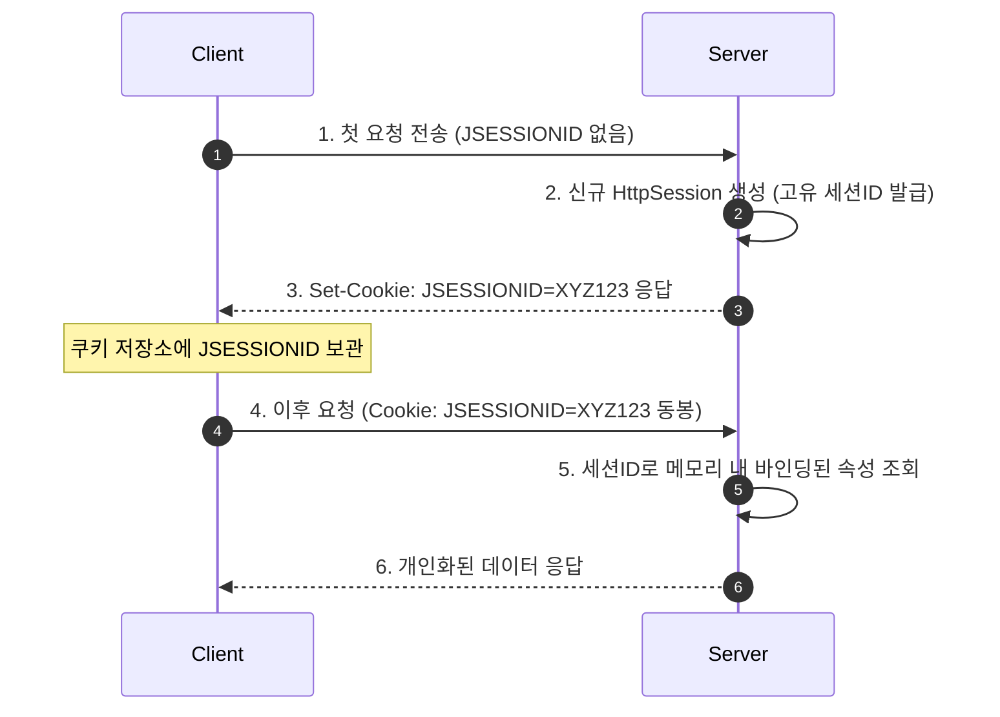

# Summary
세션(Session)은 클라이언트와 웹 서버 간의 연결 상태를 **서버 측 메모리에 보관하여 유지하는 상태 관리 기술**이다. HTTP 프로토콜의 Stateless(무상태) 특성을 극복하며, 클라이언트 브라우저마다 고유한 세션 ID(`JSESSIONID`)를 쿠키로 발급하여 사용자를 식별한다.

---

# Why it matters
1. **보안성 높은 사용자 인증 상태 유지**: 사용자 인증 정보나 장바구니 데이터를 클라이언트가 아닌 서버 측 메모리에 안전하게 격리 보관한다.
2. **세션 타임아웃을 통한 자원 관리**: 비활성 사용자 세션을 자동으로 만료시켜 서버 메모리 누수를 방지한다.

---

# Key Ideas

## 1. 세션의 동작 원리



## 2. `HttpSession` 주요 메서드
- `session.setAttribute(String name, Object value)`: 세션에 데이터 저장
- `session.getAttribute(String name)`: 세션 데이터 조회 (Object 타입 반환)
- `session.removeAttribute(String name)`: 특정 세션 속성 제거
- `session.invalidate()`: **현재 세션을 완전히 무효화/삭제 (로그아웃 시 필수 호출)**
- `session.getId()`: 발급된 고유 세션 ID 문자열 반환
- `session.setMaxInactiveInterval(int interval)`: 세션 유효시간 설정 (초 단위, 기본 30분=1800초)

---

# Examples

### 로그인 처리 및 세션 생성 (`loginProcess.jsp`)
```jsp
<%@ page language="java" contentType="text/html; charset=UTF-8" pageEncoding="UTF-8"%>
<%
    String id = request.getParameter("id");
    String pw = request.getParameter("passwd");

    // 간이 인증 로직 (실제는 DB 조회)
    if ("admin".equals(id) && "1234".equals(pw)) {
        session.setAttribute("userID", id);
        session.setAttribute("userRole", "ADMIN");
        session.setMaxInactiveInterval(1800); // 30분
        response.sendRedirect("welcome.jsp");
    } else {
        response.sendRedirect("login.jsp?error=1");
    }
%>
```

### 로그아웃 처리 (`logout.jsp`)
```jsp
<%@ page language="java" contentType="text/html; charset=UTF-8" pageEncoding="UTF-8"%>
<%
    session.invalidate(); // 모든 세션 데이터 파기
    response.sendRedirect("login.jsp");
%>
```

---

# Related Concepts
- [Ch05. 내장 객체](ch05-implicit-objects.md) - `session` 내장 객체 및 Session Scope
- [Ch14. 쿠키](ch14-cookie.md) - JSESSIONID를 전달하는 쿠키와의 차이점 비교

---

# Citations
- `raw/notes/JSP/Ch13 세션.pptx`
