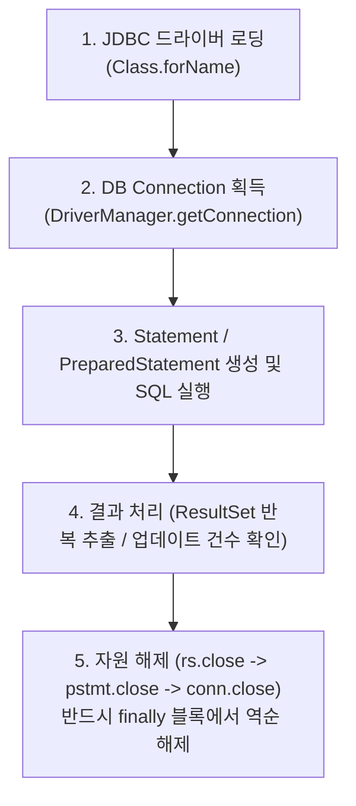

# Summary
JDBC(Java Database Connectivity)는 자바 프로그램이 이기종 관계형 데이터베이스(DBMS)와 통신하여 SQL 문을 실행하고 결과를 조회할 수 있도록 지원하는 표준 자바 API(`java.sql.*`)이다. 실무 웹 환경에서는 매 요청마다 발생하는 물리 연결 생성 비용을 줄이기 위해 **DBCP(Database Connection Pool)**를 사용한다.

---

# Why it matters
1. **SQL Injection 방어**: `PreparedStatement`의 바인딩 파라미터(`?`)를 사용하여 악의적인 SQL 삽입 공격을 원천 차단한다.
2. **웹 서버 성능 극대화**: 커넥션 풀(DBCP)을 통해 미리 생성된 DB 커넥션을 재사용하여 응답 속도와 동시 처리량을 대폭 향상시킨다.

---

# Key Ideas

## 1. JDBC 연동 표준 5단계



## 2. Statement vs PreparedStatement 비교

| 비교 항목 | Statement | PreparedStatement |
| :--- | :--- | :--- |
| **SQL 구문 분석** | 실행할 때마다 매번 SQL 파싱 및 컴파일 수행 | 최초 1회만 컴파일 후 캐싱되어 재사용 (성능 우수) |
| **파라미터 전달** | 문자열 연결 연산자(`+`)로 직접 조합 | 위치 홀더(`?`)를 이용한 타입 안전 바인딩 |
| **보안성** | ⚠️ SQL Injection 공격에 극히 취약 | ✅ 특수문자 자동 이스케이프 처리로 SQL Injection 방어 |

## 3. 커넥션 풀 (DBCP, DataBase Connection Pool)
- 웹 서버 기동 시 정해진 개수의 `Connection` 객체를 풀(Pool)에 미리 생성해 둔다.
- 클라이언트 요청 시 풀에서 커넥션을 빌려와 사용한 후, `conn.close()` 호출 시 연결을 끊지 않고 풀에 반납한다.

---

# Examples

### PreparedStatement를 이용한 회원 조회 DAO 패턴 예제
```java
package dao;

import java.sql.*;
import java.util.ArrayList;
import java.util.List;
import dto.MemberDTO;

public class MemberDAO {
    private String url = "jdbc:mysql://localhost:3306/jspbookdb?useSSL=false&serverTimezone=UTC";
    private String dbUser = "jspuser";
    private String dbPass = "jsppass";

    // 드라이버 로딩
    public MemberDAO() {
        try {
            Class.forName("com.mysql.cj.jdbc.Driver");
        } catch (ClassNotFoundException e) {
            e.printStackTrace();
        }
    }

    public MemberDTO getMember(String id) {
        String sql = "SELECT id, name, email FROM member WHERE id = ?";
        Connection conn = null;
        PreparedStatement pstmt = null;
        ResultSet rs = null;
        MemberDTO member = null;

        try {
            conn = DriverManager.getConnection(url, dbUser, dbPass);
            pstmt = conn.prepareStatement(sql);
            pstmt.setString(1, id); // ? 파라미터 매핑
            rs = pstmt.executeQuery();

            if (rs.next()) {
                member = new MemberDTO();
                member.setId(rs.getString("id"));
                member.setName(rs.getString("name"));
            }
        } catch (SQLException e) {
            e.printStackTrace();
        } finally {
            // 역순 자원 해제 필수
            if (rs != null) try { rs.close(); } catch (SQLException e) {}
            if (pstmt != null) try { pstmt.close(); } catch (SQLException e) {}
            if (conn != null) try { conn.close(); } catch (SQLException e) {}
        }
        return member;
    }
}
```

---

# Related Concepts
- [Ch15. DB 환경 구축](ch15-database-setup.md) - 데이터베이스 및 테이블 생성
- [Ch18. 웹 MVC](ch18-web-mvc.md) - Model 계층에서의 DAO / DTO 설계

---

# Citations
- `raw/notes/JSP/Ch16 JDBC로 데이터베이스와 JSP 연동.pptx`
