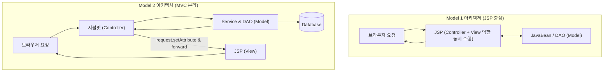
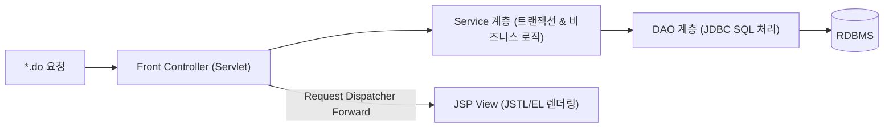

# Summary
MVC(Model-View-Controller) 아키텍처는 웹 애플리케이션의 구조를 **데이터와 비즈니스 로직(Model)**, **화면 표현(View)**, **요청 흐름 제어(Controller)**의 3가지 역할로 명확히 분리하는 표준 소프트웨어 디자인 패턴이다. JSP/서블릿에서는 **Model 2 (서블릿=Controller, JSP=View, JavaBean/DAO=Model)** 구조를 표준으로 채택한다.

---

# Why it matters
1. **유지보수성과 확장성 극대화**: 비즈니스 로직 수정 시 화면(View) 코드를 건드릴 필요가 없고, UI 디자인 개편 시 백엔드 로직에 영향을 주지 않는다.
2. **Spring MVC 프레임워크의 직접적 모태**: `DispatcherServlet`, 핸들러 매핑, Controller-Service-Repository 계층 구조의 원형이다.

---

# Key Ideas

## 1. Model 1 vs Model 2 아키텍처 비교



| 구분 | Model 1 | Model 2 (MVC) |
| :--- | :--- | :--- |
| **Controller 역할** | JSP 페이지가 직접 요청을 받아 비즈니스 로직과 화면 처리 | **서블릿(Servlet)**이 요청을 받아 흐름을 총괄 제어 |
| **View 역할** | JSP가 화면 출력 | **JSP (JSTL/EL)**가 순수 화면 출력만 담당 |
| **Model 역할** | JavaBean / DAO | Service, DAO, DTO |
| **장점** | 구조가 단순하여 빠른 개발 가능 | 유지보수, 협업, 코드 재사용성, 확장성이 매우 뛰어남 |
| **단점** | 코드가 섞여 유지보수가 극히 어려움 (스파게티 코드) | 설계가 복잡하고 초기 개발 공수가 많이 듦 |

## 2. Front Controller 패턴과 계층 구조
모든 클라이언트 요청을 단일 서블릿(`FrontControllerServlet` 또는 `*.do`)에서 일괄 수신한 뒤, URI 경로에 따라 전용 컨트롤러(Action) 또는 서비스로 분기 처리한다.



---

# Examples

### 서블릿 컨트롤러 구현 (`controller/MemberListController.java`)
```java
package controller;

import java.io.IOException;
import java.util.List;
import javax.servlet.ServletException;
import javax.servlet.annotation.WebServlet;
import javax.servlet.http.*;
import dao.MemberDAO;
import dto.MemberDTO;

@WebServlet("/memberList.do")
public class MemberListController extends HttpServlet {
    @Override
    protected void doGet(HttpServletRequest request, HttpServletResponse response)
            throws ServletException, IOException {
        // 1. Model(DAO)을 통해 데이터 조회
        MemberDAO dao = new MemberDAO();
        List<MemberDTO> list = dao.getAllMembers();

        // 2. View로 전달할 데이터를 request 영역에 바인딩
        request.setAttribute("memberList", list);

        // 3. JSP View로 포워딩 (URL 변경 없음)
        request.getRequestDispatcher("/WEB-INF/views/memberList.jsp")
               .forward(request, response);
    }
}
```

---

# Related Concepts
- [Ch01. JSP 개요](ch01-overview.md) - 서블릿 컨테이너 환경
- [Ch04. 액션 태그](ch04-action-tags.md) - `forward` 제어권 전달
- [Ch05. 내장 객체](ch05-implicit-objects.md) - Request Scope 데이터 바인딩
- [Ch16. JDBC 데이터베이스](ch16-jdbc-database.md) - DAO 계층의 데이터베이스 연동
- [Ch17. JSTL & EL](ch17-jstl-el.md) - Model 2의 View 계층 렌더링

---

# Citations
- `raw/notes/JSP/Ch18 웹 MVC.pptx`
