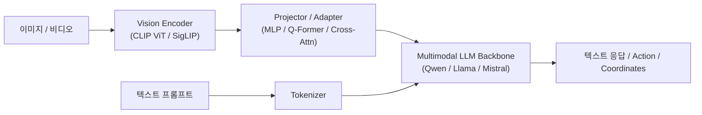

# Summary
영상에서 객체의 존재, 위치, 영역, 관계를 이해하는 시각 인식(Visual Recognition) 기술의 발전 과정을 다룹니다. 분류(Classification), 객체 검출(2-Stage Faster R-CNN vs 1-Stage YOLO vs Transformer 기반 DETR), 세그멘테이션(Mask R-CNN, SAM), 그리고 대규모 언어 모델과 시각 인코더가 결합된 Vision-Language Model(VLM / LMM) 구조를 포괄합니다.

# Why it matters
* **자율주행 및 로보틱스 인식기**: 차량, 보행자, 차선, 장애물 인식의 표준 백본입니다.
* **멀티모달 AI 에이전트의 눈**: 화면 GUI 조작 에이전트, visual reasoning, 문서 이해(OCR/VQA)의 핵심 모델 아키텍처입니다.

# Key Ideas

## 1. 객체 검출 패러다임 (Object Detection)
* **2-Stage Detectors (Faster R-CNN)**: RPN(Region Proposal Network)으로 후보 영역 생성 $\rightarrow$ RoI Pooling/Align $\rightarrow$ 분류 및 바운딩 박스 회귀. 정확도가 높으나 추론 속도가 느림.
* **1-Stage Detectors (YOLO, SSD, RetinaNet)**: 앵커 박스 또는 앵커 프리 방식으로 그리드 셀에서 클래스 확률과 박스 좌표를 단일 forward pass로 직접 예측. Focal Loss를 통한 불균형 해소.
* **Transformer 기반 검출 (DETR, Deformable DETR)**: 앵커 박스와 NMS(Non-Maximum Suppression)를 제거하고, Object Query와 bipartite matching(Hungarian Loss)을 통해 End-to-End 집합 예측.

## 2. 세그멘테이션 (Segmentation)
* **시맨틱 세그멘테이션 (Semantic Segmentation)**: 픽셀별 클래스 분류 (FCN, U-Net, DeepLabv3+).
* **인스턴스 세그멘테이션 (Instance Segmentation)**: 개별 객체 구분 + 픽셀 마스크 추출 (Mask R-CNN).
* **파놉틱 세그멘테이션 (Panoptic Segmentation)**: Things(셀 수 있는 객체) + Stuff(배경, 도로 등)의 통합 분할.
* **Segment Anything Model (SAM / SAM 2)**: 프롬프트 기반(점, 박스, 텍스트) 범용 제로샷 세그멘테이션 파운데이션 모델.

## 3. Vision-Language Model (VLM / LMM)
시각 신호(이미지/비디오)를 텍스트 토큰 임베딩 공간과 정렬하여 언어 모델이 시각 정보를 추론하도록 만드는 아키텍처입니다.



* **Vision Backbone**: CLIP, SigLIP, DINOv2와 같은 대규모 사전학습 Vision Transformer.
* **Vision-Language Alignment**:
  * **MLP Projector (LLaVA 스타일)**: 이미지 패치 임베딩을 단순 선형/2계층 MLP로 LLM 차원에 투영.
  * **Resampler / Perceiver / Q-Former**: 고정된 개수의 visual query 토큰으로 압축하여 LLM에 입력.
  * **Cross-Attention (Flamingo 스타일)**: LLM 중간 레이어에 Visual cross-attention layer 삽입.

# Examples

```python
# VLM 추론 개념 구조 (HuggingFace Transformers 예시)
from transformers import AutoProcessor, AutoModelForVision2Seq
from PIL import Image

# processor = AutoProcessor.from_pretrained("Qwen/Qwen2-VL-7B-Instruct")
# model = AutoModelForVision2Seq.from_pretrained("Qwen/Qwen2-VL-7B-Instruct")
# inputs = processor(text="Describe the bounding box of the car in [ymin, xmin, ymax, xmax].", images=image, return_tensors="pt")
# outputs = model.generate(**inputs)
```

# Related Concepts
* [Deep Learning for Vision](04-deep-learning-for-vision.md) - CNN 및 ViT 백본 구조
* [Feature Detection & Matching](06-feature-detection-and-matching.md) - 고전 특징점 기반 정합과의 비교

# Citations
* Richard Szeliski, *Computer Vision: Algorithms and Applications (2nd Edition)*, Chapter 6: Recognition.
