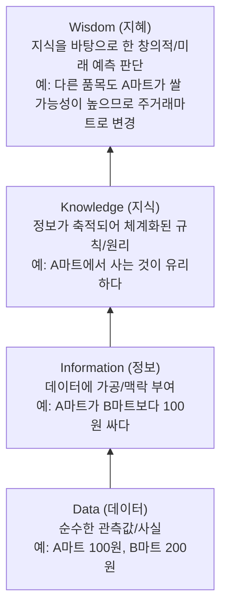

# Summary
데이터는 단순한 사실의 관측값이며, 이를 가공·정제하여 맥락(Context)을 부여하면 정보(Information)가 되고, 체계화된 규칙이 결합되면 지식(Knowledge)과 지혜(Wisdom)로 진화한다(DIKW 구조). 현대 데이터 아키텍처는 정형/반정형/비정형의 모든 데이터를 수용하기 위해 관계형 DBMS에서 데이터웨어하우스(DW), 데이터마트(DM), 데이터레이크(Data Lake)로 확장되고 있다.

---

# Why it matters
- **데이터 분석 가치 창출의 출발점**: 가공되지 않은 Raw Data로부터 비즈니스 의사결정에 직결되는 지식과 통찰을 도출하는 메커니즘을 규정한다.
- **데이터 저장소 인프라 선택 기준**: 데이터의 구조화 수준(스키마 유무)에 따라 최적의 저장/처리 아키텍처를 설계할 수 있다.

---

# Key Ideas

## 1. DIKW 피라미드 (Data-Information-Knowledge-Wisdom)

## 2. 데이터 구조화 형태별 분류

| 구분 | 특성 | 주요 데이터 형식 | 처리 기술 |
| :--- | :--- | :--- | :--- |
| **정형 데이터 (Structured)** | 고정된 스키마(Schema)와 테이블 형태를 가지며 연산/검색이 용이함 | RDBMS 테이블, CSV, Excel | SQL, RDBMS |
| **반정형 데이터 (Semi-Structured)** | 고정된 테이블 스키마는 없으나 데이터 내에 메타데이터/태그를 포함함 | JSON, XML, HTML, 로그 파일 | NoSQL (MongoDB), ElasticSearch |
| **비정형 데이터 (Unstructured)** | 형태가 정해져 있지 않고 연산 가능한 구조가 없는 데이터 | 텍스트(NLP), 이미지, 음성, 영상 | 하둡(HDFS), 딥러닝, 분산 객체 스토리지 |

## 3. 데이터 저장소 아키텍처 비교
- **데이터베이스 (OLTP)**: 실시간 트랜잭션 처리(Insert/Update) 최적화, 정규화(Normalization) 구조.
- **데이터웨어하우스 (DW / OLAP)**: 기업 전체의 의사결정 지원을 위한 주제 중심적(Subject-oriented), 통합적(Integrated), 시계열적(Time-variant), 비휘발성(Non-volatile) 대용량 저장소.
- **데이터마트 (DM)**: 특정 부서나 특정 주제에 맞게 DW에서 추출한 소규모 맞춤형 데이터 집합.
- **데이터레이크 (Data Lake)**: 원천 데이터(Raw Data)를 변환 없이(ELT 방식) 대규모 분산 스토리지에 원형 그대로 저장하는 저장소.

---

# Related Concepts
- [02. 빅데이터 특성과 가치](02-bigdata-characteristics-value.md) - 대용량 데이터의 가치
- [05. 데이터 분석 방법론](05-data-analysis-methodology.md) - 저장된 데이터를 추출하고 정제하는 파이프라인

---

# Citations
- `raw/notes/Bigdata_analysis/빅분기자료/1과목_1_데이터와 정보.pdf`
- `raw/notes/Bigdata_analysis/빅데이터분석기사_모든것_ocr.pdf`
