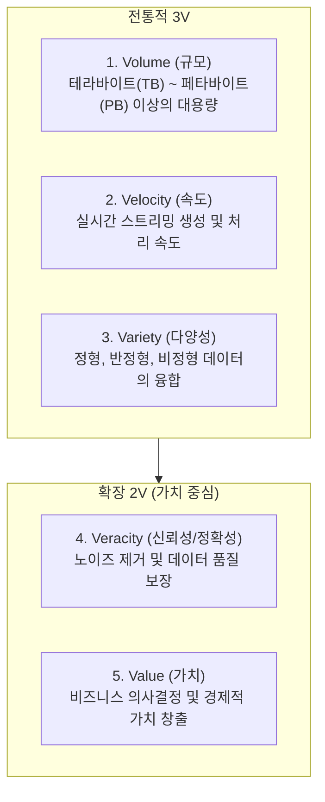

# Summary
빅데이터(Big Data)는 기존의 데이터베이스 관리 도구의 능력을 넘어서는 대량(Volume), 고속 생성(Velocity), 다양성(Variety)을 지닌 데이터 집합을 의미한다. 최근에는 정확성(Veracity)과 궁극적인 가치(Value)를 더한 **5V**로 정의되며, 단순한 사후 분석을 넘어 예측(Predictive)과 처방(Prescriptive) 중심의 비즈니스 가치 창출을 견인한다.

---

# Key Ideas

## 1. 빅데이터 3V + 2V 확장 정의

## 2. 패러다임의 4대 근본적 변화
1. **표본조사(Sample)에서 전수조사(Census)**: 샘플링 통계 추정을 넘어 전체 데이터를 실시간 수집·분석 가능.
2. **사전처리에서 사후처리**: 스키마 우선 설계(Schema-on-Write)에서 원시 데이터를 먼저 적재 후 분석 시점에 구조화(Schema-on-Read)하는 방식으로 전환.
3. **인과관계(Causality)에서 상관관계(Correlation)**: "왜 그런가(Why)"를 규명하기보다 "무엇이 일어나는가(What)"의 패턴과 상관성에 집중하여 신속한 예측 수행.
4. **질보다 양**: 데이터의 양이 기하급수적으로 늘어나면서 일부 노이즈가 존재하더라도 전반적인 예측 정확도가 향상됨.

---

# Related Concepts
- [01. 데이터와 정보](01-data-and-information.md) - 원시 데이터의 축적
- [03. 전략적 인사이트](03-bigdata-strategy-insights.md) - 빅데이터 가치 창출 전략

---

# Citations
- `raw/notes/Bigdata_analysis/빅분기자료/1과목_2_빅데이터의 이해.pdf`
