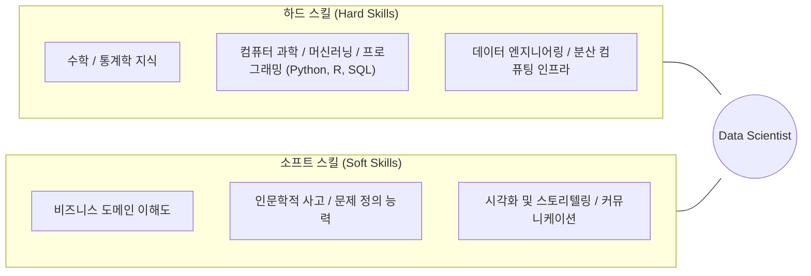

# Summary
데이터 사이언스(Data Science)는 정형/비정형 데이터를 포함한 다양한 데이터로부터 지식과 통찰을 추출하기 위해 통계학, 컴퓨터 과학, 도메인 지식을 융합하는 다학제적(Multidisciplinary) 학문이다. 데이터 사이언티스트는 기술적 분석 능력뿐만 아니라 문제의 본질을 꿰뚫는 **인문학적 통찰과 스토리텔링 역량**을 함께 갖추어야 한다.

---

# Key Ideas

## 1. 데이터 사이언티스트 핵심 역량 (Hard Skill vs Soft Skill)

## 2. 인문학적 소양의 중요성
- 단순한 데이터 집계와 패턴 인식을 넘어 **"인간과 사회의 행동 원인"**을 이해하고 올바른 비즈니스 질문을 던질 수 있는 힘을 제공한다.
- 고정관념을 탈피하고 창의적 가설을 설정하는 프레임워크를 수립한다.

---

# Related Concepts
- [04. 분석 기획 및 과제 발굴](04-analysis-planning-directions.md) - 통찰을 기획으로 구체화하는 방법론

---

# Citations
- `raw/notes/Bigdata_analysis/빅분기자료/1과목_3_빅데이터 분석과 전략 인사이트.pdf`
