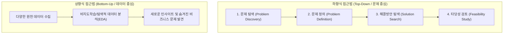

# Summary
분석 기획(Analysis Planning)은 실제 데이터 분석을 착수하기 전에 해결해야 할 비즈니스 문제를 명확히 정의하고, 데이터 확보 가능성 및 분석 타당성을 검토하여 분석 과제를 도출하는 전 단계이다. 과제 발굴은 전통적인 **하향식 접근법(Top-Down Approach)**과 탐색 중심의 **상향식 접근법(Bottom-Up Approach)**을 상호보완적으로 융합하여 수행한다.

---

# Key Ideas

## 1. 분석 대상(What)과 분석 방법(How)에 따른 4대 유형

| 대상 (What) \ 방법 (How) | 알고 있음 (Known) | 모름 (UnKnown) |
| :--- | :--- | :--- |
| **알고 있음 (Known)** | **최적화 (Optimization)** 문제와 해결 방식을 모두 알고 있어 효율을 극대화함 | **통찰 (Insight)** 문제는 알지만 해결 방법을 몰라 새로운 패턴을 탐색함 |
| **모름 (UnKnown)** | **솔루션 (Solution)** 방법은 알고 있으나 새로운 문제 영역에 적용함 | **발견 (Discovery)** 대상과 방법 모두 불명확하여 탐색적 연구를 수행함 |

## 2. 하향식 접근법 vs 상향식 접근법

- **디자인 씽킹 (Design Thinking)**: 발산(Divergence, 상향식) 단계와 수렴(Convergence, 하향식) 단계를 반복하여 사용자의 숨은 요구를 발굴하고 실행 가능한 솔루션을 도출함.

---

# Related Concepts
- [05. 데이터 분석 방법론](05-data-analysis-methodology.md) - 도출된 과제를 수행하는 분석 프레임워크
- [06. 분석 마스터플랜](06-analysis-masterplan-governance.md) - 발굴된 과제의 우선순위 평가

---

# Citations
- `raw/notes/Bigdata_analysis/빅분기자료/3과목_1_분석 기획의 방향성 이해.pdf`
- `raw/notes/Bigdata_analysis/빅분기자료/3과목_3_데이터 분석 과제 발굴_ 방법론과 실천.pdf`
