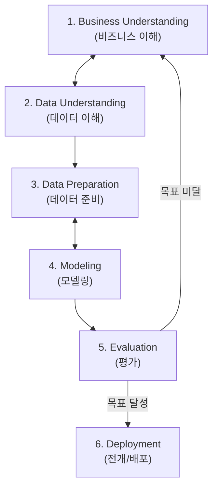

# Summary
데이터 분석 방법론은 데이터 분석 프로젝트를 성공적으로 수행하기 위해 절차, 방법, 도구, 산출물 등을 표준화한 체계이다. 학술적 기초인 **KDD(Knowledge Discovery in Databases)**, 산업계 표준인 **CRISP-DM**, 그리고 현대 **빅데이터 분석 5단계 방법론**이 널리 활용된다.

---

# Key Ideas

## 1. KDD 프로세스 5단계
1. **데이터셋 선택 (Selection)**: 분석 목적에 맞는 목표 데이터(Target Data) 추출.
2. **데이터 전처리 (Preprocessing)**: 노이즈, 이상치, 결측치 정제.
3. **데이터 변환 (Transformation)**: 정규화, 파생변수 생성, 차원축소.
4. **데이터 마이닝 (Data Mining)**: 분류, 군집, 회귀 알고리즘 적용 및 패턴 추출.
5. **결과 평가 (Evaluation)**: 발견된 지식의 유효성 검증 및 해석.

## 2. CRISP-DM 6단계 프로세스

## 3. 빅데이터 분석 5단계 생명주기
1. **분석 기획 (Planning)**: 비즈니스 이해, 프로젝트 정의, 프로젝트 계획 수립.
2. **데이터 준비 (Preparing)**: 데이터 정의, 데이터 획득(수집), 데이터 정제 및 검증.
3. **데이터 분석 (Analyzing)**: 분석용 데이터셋 준비, 텍스트/통계/머신러닝 모델링, 모델 평가 및 검증.
4. **시스템 구현 (Developing)**: 시스템 설계, 프로그래밍, 통합 테스트.
5. **평가 및 전개 (Deploying)**: 모델 운영 배포, 유지보수 및 모니터링 체계 수립.

---

# Related Concepts
- [04. 분석 기획](04-analysis-planning-directions.md) - 분석 기획 단계
- [11. 데이터마이닝 전처리](11-datamining-and-preprocessing.md) - 전처리 및 변환 실무

---

# Citations
- `raw/notes/Bigdata_analysis/빅분기자료/3과목_2_데이터 분석 방법론의 이해.pdf`
