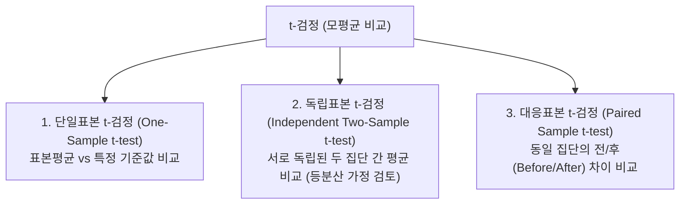

# Summary
추론통계(Inferential Statistics)는 표본(Sample) 데이터를 분석하여 미지의 모집단(Population) 모수를 추정하고, 가설의 타당성을 통계적 유의성으로 검증하는 학문이다. **귀무가설($H_0$)**과 **대립가설($H_1$)**을 설정하고, 계산된 검정통계량의 **유의확률(p-value)**과 유의수준($\alpha$)을 비교하여 가설 채택/기각을 결정한다.

---

# Key Ideas

## 1. 가설 설정 및 1종/2종 오류

| 실제 사실 \ 검정 결과 | 귀무가설 채택 ($H_0$ 채택) | 귀무가설 기각 ($H_0$ 기각, $H_1$ 채택) |
| :--- | :--- | :--- |
| **$H_0$ 이 참인 경우** | 올바른 결정 ($1-\alpha$) | **제 1종 오류 (Type I Error, $\alpha$)** 참인 귀무가설을 실수로 기각함 (유의수준) |
| **$H_0$ 이 거짓인 경우** | **제 2종 오류 (Type II Error, $\beta$)** 거짓인 귀무가설을 기각하지 못함 | 올바른 결정 ($1-\beta$, **검정력/Power**) |

## 2. p-value 판정 규칙
- **$p\text{-value} < \alpha$ (0.05)** : 귀무가설($H_0$)을 **기각(Reject)**하고 대립가설($H_1$)을 채택. "통계적으로 유의미한 차이가 있다."
- **$p\text{-value} \ge \alpha$ (0.05)** : 귀무가설($H_0$)을 **기각할 수 없음(Fail to Reject)**.

## 3. t-검정 (t-Test) 3대 유형

---

# Related Concepts
- [07. 기술통계](07-descriptive-statistics-distributions.md) - 표본 통계량
- [09. 분산분석](09-anova-and-chi-square.md) - 3개 이상 집단 간 평균 비교(ANOVA)

---

# Citations
- `raw/notes/Bigdata_analysis/빅분기자료/4과목_3_통계분석 방법론.pdf`
