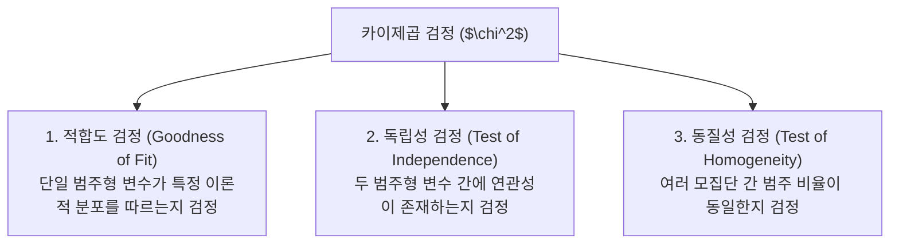

# Summary
분산분석(ANOVA, Analysis of Variance)은 3개 이상의 독립된 집단 간 평균 차이가 유의미한지를 **집단 간 분산(Between Variance)**과 **집단 내 분산(Within Variance)**의 비율(F-통계량)로 검정하는 기법이다. 교차분석 및 카이제곱 검정($\chi^2$)은 범주형 변수 간의 독립성, 동질성 및 적합도를 관측빈도와 기대빈도의 차이로 검정한다.

---

# Key Ideas

## 1. 분산분석 (ANOVA) 기본 원리
- **귀무가설($H_0$)**: 모든 집단의 모평균은 같다. ($\mu_1 = \mu_2 = \mu_3$)
- **대립가설($H_1$)**: 적어도 한 집단의 모평균은 다르다.
- **F-검정 통계량**:
  $$F = \frac{\text{집단 간 평균제곱 (MSB)}}{\text{집단 내 평균제곱 (MSW)}} = \frac{SSB / (k-1)}{SSW / (n-k)}$$
- **사후검정 (Post-Hoc Test)**: ANOVA에서 귀무가설이 기각되었을 때, 구체적으로 "어떤 집단 간에 유의미한 차이가 있는지" 규명하는 검정 (Tukey HSD, Scheffe, Bonferroni 등).

## 2. 카이제곱 검정 ($\chi^2$ Test) 3대 유형

- **카이제곱 통계량 공식**:
  $$\chi^2 = \sum \frac{(O_i - E_i)^2}{E_i} \quad (O_i: \text{관측빈도}, E_i: \text{기대빈도})$$

---

# Related Concepts
- [08. 추론통계 및 가설검정](08-inferential-statistics-hypothesis-testing.md) - 2개 집단 비교 t-검정
- [10. 상관분석 및 회귀분석](10-correlation-and-regression.md) - 연속형 변수 간 관계 분석

---

# Citations
- `raw/notes/Bigdata_analysis/빅분기자료/4과목_3_분산분석과 교차분석.pdf`
