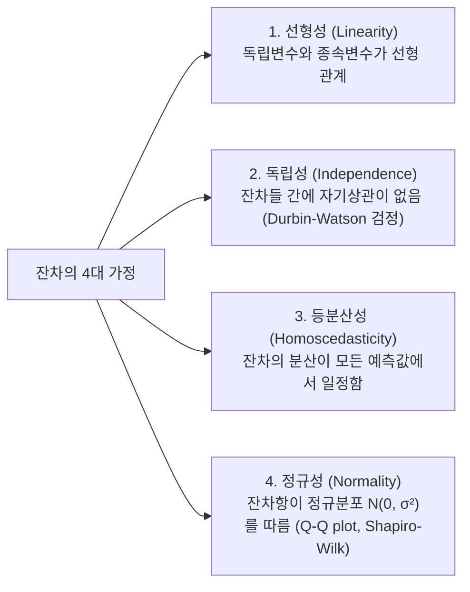

# Summary
상관분석(Correlation Analysis)은 두 연속형 변수 간 선형적 연관성의 강도와 방향을 측정하는 기법이며, 회귀분석(Regression Analysis)은 독립변수($X$)가 종속변수($Y$)에 미치는 인과적 영향력을 수학적 함수식으로 모형화하여 예측하는 통계 기법이다. 최소제곱법(OLS)을 통해 최적의 회귀계수를 추정하고, 잔차의 4대 기본 가정을 충족해야 모형이 유효하다.

---

# Key Ideas

## 1. 피어슨 vs 스피어만 상관계수
- **피어슨 상관계수 ($r$)**: 두 변수가 연속형이자 정규분포를 따를 때, **선형적 관계의 강도**를 측정 ($-1 \le r \le 1$).
- **스피어만 순위상관계수 ($
ho$)**: 서열척도(순위)이거나 비선형 단조 관계일 때 비모수적으로 순위 간 상관성을 측정.

## 2. 선형 회귀 모형과 OLS (Ordinary Least Squares)
- **단순선형회귀식**: $Y = \beta_0 + \beta_1 X + \epsilon$
- **최소제곱법**: 잔차제곱합($SSE = \sum (y_i - \hat{y}_i)^2$)을 최소화하도록 절편 $\beta_0$와 기울기 $\beta_1$을 추정.
- **결정계수 ($R^2$, R-squared)**: 총 변동 중 회귀모형에 의해 설명되는 비율 ($0 \le R^2 \le 1$).
  $$R^2 = \frac{SSR}{SST} = 1 - \frac{SSE}{SST}$$
- **수정 결정계수 (Adjusted $R^2$)**: 다중회귀에서 무의미한 독립변수 추가 시 $R^2$가 억지로 증가하는 것을 보정한 지표.

## 3. 회귀모형 잔차(Residual)의 4대 기본 가정

## 4. 다중공선성 (Multicollinearity)
- 다중회귀분석에서 독립변수들 간에 강한 상관관계가 존재하여 회귀계수 추정의 분산이 왜곡되는 현상.
- **진단 기준 (VIF, Variance Inflation Factor)**: $VIF = \frac{1}{1 - R_j^2} \ge 10$ 이면 다중공선성 문제 존재 -> 변수 제거 또는 PCA 적용.

---

# Related Concepts
- [12. 지도학습 분류 분석](12-classification-algorithms.md) - 종속변수가 범주형일 때의 로지스틱 회귀
- [11. 데이터마이닝 전처리](11-datamining-and-preprocessing.md) - 다중공선성 해결을 위한 PCA

---

# Citations
- `raw/notes/Bigdata_analysis/빅분기자료/4과목_4_회귀분석_ 기본 개념부터 실제 적용까지.pdf`
