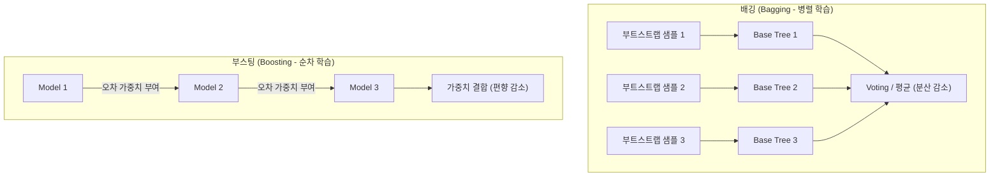

# Summary
앙상블 학습(Ensemble Learning)은 여러 개의 개별 학습기(Weak Learner)를 결합하여 단일 모델보다 훨씬 더 강력하고 안정적인 예측 성능(High Accuracy & Low Variance)을 달성하는 머신러닝 기법이다. 크게 **배깅(Bagging)**, **부스팅(Boosting)**, **보팅/스태킹(Voting/Stacking)**으로 분류된다.

---

# Key Ideas

## 1. 배깅(Bagging) vs 부스팅(Boosting) 비교

| 구분 | 배깅 (Bagging, Random Forest) | 부스팅 (Boosting, XGBoost, LightGBM) |
| :--- | :--- | :--- |
| **학습 방식** | 부트스트랩 샘플링 후 **병렬(Parallel)** 독립 학습 | 이전 모델의 오차를 보정하며 **순차(Sequential)** 학습 |
| **목적** | 과적합 방지 및 **분산(Variance) 감소** | 예측력 극대화 및 **편향(Bias) 감소** |
| **주요 모델** | Random Forest, Extra Trees | AdaBoost, Gradient Boosting, XGBoost, LightGBM, CatBoost |

## 2. 주요 부스팅 프레임워크
- **XGBoost**: GBM 기반으로 과적합 방지 규제(L1/L2), 결측치 자동 처리, 병렬 CPU 학습 지원.
- **LightGBM**: 리프 중심 트리 분할(Leaf-wise) 방식을 채택하여 대용량 데이터에서 학습 속도가 매우 빠르고 메모리 소모가 적음.
- **스태킹 (Stacking)**: 서로 다른 여러 기본 모델들의 예측 결과를 새로운 메타 데이터셋으로 구성하여 상위 메타 모델(Meta-Learner)이 최종 예측을 수행.

---

# Related Concepts
- [12. 분류 분석](12-classification-algorithms.md) - 단일 의사결정나무
- [15. 모델 평가](15-model-evaluation-and-optimization.md) - 교차검증 및 하이퍼파라미터 튜닝

---

# Citations
- `raw/notes/Bigdata_analysis/빅분기자료/4과목_5_분류분석의 개요.pdf`
