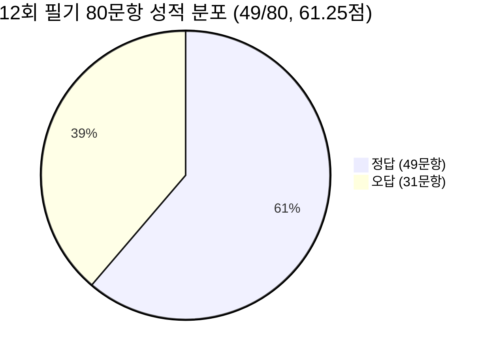
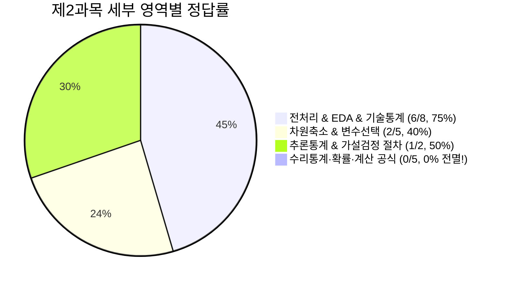
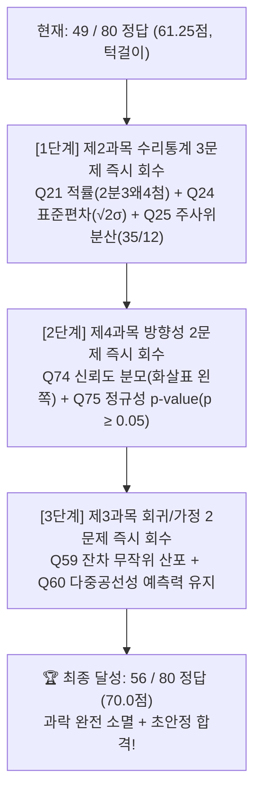

# Big Data Analysis 12th Written Exam Comprehensive Scorecard & Gap Analysis Report
## 제12회 빅데이터 분석기사 필기 성적 진단 및 취약점 역공학 보고서

---

## Executive Summary: 성적 총괄 및 핵심 진단

2026년 상반기 시행된 **빅데이터 분석기사 필기 제12회 기출시험 80문항에 대한 실제 수험자 정오 데이터(초록=정답, 빨강=오답)**를 전수 분석한 결과입니다.

### 1. 12회 80문항 실제 성적표 요약

| 과목 | 문항 범위 | 정답 수 / 총 문항 | 오답 수 | 과목 환산 점수 | 과락 기준(40점) 여부 | 과목별 상태 진단 |
| :--- | :---: | :---: | :---: | :---: | :---: | :--- |
| **제1과목 빅데이터 분석 기획** | 01번 ~ 20번 | **12 / 20** | 8 | **60점** | **안전 통과 (+20점)** | 후반부(11~18번) 집중 실점 |
| **제2과목 빅데이터 탐색** | 21번 ~ 40번 | **9 / 20** | **11** | **45점 🚨** | **위험 통과 (+5점)** | **최우선 보강 구역 (과락 턱밑)** |
| **제3과목 빅데이터 모델링** | 41번 ~ 60번 | **12 / 20** | 8 | **60점** | **안전 통과 (+20점)** | 후반부(51~60번) 가정/검정 실점 |
| **제4과목 빅데이터 결과 해석** | 61번 ~ 80번 | **16 / 20** | 4 | **80점 🔥** | **초안정 통과 (+40점)** | 최강 득점밭 (국소적 구멍만 보완) |
| **전 과목 종합** | **01번 ~ 80번** | **49 / 80** | **31** | **61.25점** | **최종 합격권 (+1.25점)** | **안정권 도달을 위해 +6문제 필요** |

### 2. 핵심 진단 및 전략적 시사점
1. **합격선 턱걸이 (+1문제 차이)**:
   - 합격선 60점(48문제 정답) 대비 **단 1문제 차이(49문제 정답, 61.25점)**로 합격선을 통과한 상태입니다.
   - 작은 난이도 변동이나 실수 1~2개로 불합격선으로 내려갈 수 있으므로, **목표 점수를 55/80(68.75점) 이상으로 설정하고 31개 오답 중 가장 회수하기 쉬운 6~10문제를 타격**해야 합니다.
2. **2과목(빅데이터 탐색, 45점)이 최우선 과락 방어 대상**:
   - 9개 정답으로 과락 기준선(8개 이상 정답, 40점)보다 단 1문제 앞서 있습니다. 2문제가 더 흔들리면 즉시 과락(35점) 탈락 위험이 발생하므로 **모든 보강 학습의 1순위는 제2과목**이어야 합니다.
3. **10문항 단위 정답률 흐름의 명확성**:
   - **강한 구간**: 1~10번(80%), 41~50번(70%), **61~70번(90%)**, 71~80번(70%)
   - **위험 구간**: **11~20번(40%)**, **21~30번(40%)**, 31~40번(50%), 51~60번(50%)
   - $\Longrightarrow$ **11번부터 40번까지의 30문항 구간**에서 총점의 대부분을 잃었습니다.

---

## Part 1. [제2과목 빅데이터 탐색] 심층 취약점 지도 (9/20, 45점 🚨)

제2과목 20문항을 4대 세부 영역으로 분해하면 점수가 샌 구멍이 완벽하게 드러납니다.

### 1. 세부 영역별 성적표
| 세부 영역 | 해당 문항 | 정답 / 오답 | 정답률 | 상태 진단 |
| :--- | :--- | :---: | :---: | :--- |
| **① 전처리 & EDA & 기초통계** | 22, 23, 26, 28, 30, 32, 37, 38 | **6 / 8** | **75%** | 🟢 **안정권 (합격 수준 확보)** |
| **② 차원축소 & 변수선택** | 29, 34, 36, 39, 40 | **2 / 5** | **40%** | 🟡 **주의 (기법별 대전제 혼선)** |
| **③ 추론통계 & 가설검정 절차** | 31, 33 | **1 / 2** | **50%** | 🟡 **보통 (절차 선후관계 암기 필요)** |
| **④ 수리통계·확률·계산 공식** | **21, 24, 25, 27, 35** | **0 / 5** | **0% 🚨** | 🔴 **치명적 뇌관 (전멸 구간!)** |

> **결론**: 전처리/EDA는 이미 75%로 탄탄합니다. 과락 턱밑까지 떨어진 유일한 이유는 **[④ 수리통계·확률 공식 5문제 전멸]** 때문입니다.

### 2. 제2과목 오답 11문항 역공학 원인 분석 및 1초 컷 처방전

| 문항 | 핵심 출제 주제 | 정답 | 오답 원인 및 낚인 함정 | 1타 강사 3초 컷 처방전 |
| :---: | :--- | :---: | :--- | :--- |
| **21** | **중심적률과 왜도/첨도** | ② | 3차 중심적률을 보고 첨도로 혼동 | **“2분 · 3왜 · 4첨 (2차 분산, 3차 왜도, 4차 첨도)!”** |
| **23** | **이상값 발생 원인** | ③ | 표본오차가 이상값 원인이라고 오인 | **“측·관·보는 값을 왜곡(이상치), 표본오차는 대표성 차이!”** |
| **24** | **독립합 표준편차** | ① | 분산 $2\sigma^2$ 구하고 루트($\sqrt{}$) 안 씌움 ($2\sigma$ 오답) | **“표준편차 직접 더하지 말고, 분산 합산 후 마지막에 루트($\sqrt{2}\sigma$)!”** |
| **25** | **주사위 분산 계산** | ④ | $E[X^2]=\frac{91}{6}$만 구하고 $(E[X])^2=\frac{49}{4}$ 안 뺌 | **“분산 = 제평 - 평제!” 주사위 분산은 무조건 $\frac{35}{12}$!** |
| **27** | **CLT vs LLN** | ④ | 표본평균 수렴(LLN)과 정규분포 근사(CLT) 혼동 | **“평균의 '값' $\to$ 모평균은 LLN, 평균들의 '분포' $\to$ 정규분포는 CLT!”** |
| **29** | **차원축소 행렬 조건** | ② | SVD가 정방행렬에서만 된다는 선지에 낚임 | **“SVD = 직사각형($m \times n$) 행렬도 무조건 OK!”** |
| **32** | **데이터 변환 4대 기법** | ③ | 평활화를 새로운 변수 생성으로 오인 | **“평활화(Smoothing)는 울퉁불퉁 잡음 제거, 변수 생성은 특성 생성!”** |
| **33** | **가설검정 5단계 절차** | ② | 통계량 계산 후 사후 유의수준 설정으로 오인 | **“가 $\to$ 유 $\to$ 통 $\to$ 피 $\to$ 결 (유의수준은 데이터 보기 전 사전 확정)!”** |
| **34** | **변수선택 3대 기법** | ③ | 래퍼(Wrapper)가 계산량이 적다는 선지에 낚임 | **“필·전 (필터=학습 전) / 래·반 (래퍼=반복학습 최대비용) / 임·동 (임베디드=동시)!”** |
| **35** | **4대 평균과 이상치** | ① | 절사평균이 이상치 영향을 더 크게 받는다고 오인 | **“절사평균은 이상치를 잘라내어 영향이 극소(강건함)!”** |
| **39** | **PCA vs 요인분석** | ③ | PCA가 공통분산만 이용한다는 선지에 낚임 | **“PCA는 전체 분산 압축 / 요인분석(FA)은 공통 분산 잠재요인!”** |

---

## Part 2. [제1과목 빅데이터 분석 기획] 취약점 지도 (12/20, 60점)

### 1. 구간별 정답률 진단
* **전반부 (01번 ~ 10번)**: **8 / 10 (80%)** $\rightarrow$ 빅데이터 저장/수집/기술 완벽 장악
* **후반부 (11번 ~ 20번)**: **4 / 10 (40%)** $\rightarrow$ **11~14번 4연속 오답 + 17~18번 2연속 오답으로 붕괴**

### 2. 제1과목 오답 8문항 역공학 원인 분석 및 1초 컷 처방전

| 문항 | 핵심 출제 주제 | 정답 | 오답 원인 및 낚인 함정 | 1타 강사 3초 컷 처방전 |
| :---: | :--- | :---: | :--- | :--- |
| **06** | **플랫폼 계층 구조** | ③ | 자원 할당을 소프트웨어 계층으로 오인 | **“기능/처리/시각화=소프트웨어 / CPU·메모리 자원할당=플랫폼 계층(YARN)!”** |
| **08** | **HDFS 아키텍처** | ③ | NameNode가 파일 데이터를 직접 저장한다고 오판 | **“NameNode=지도/메타데이터(SPOF), DataNode=실제 파일 블록(3중 복제)!”** |
| **11** | **KDD vs CRISP-DM** | ④ | 비즈니스 평가(Evaluation) 단계의 성격 혼동 | **“KDD=선전변마평(데이터 중심 5단계) / CRISP-DM=업데준모평전(비즈니스 6단계)!”** |
| **12** | **도메인 이슈 도출** | ② | 업무 요구사항 정의서와 시스템 명세서 혼동 | **“문제 정의 + 분석 요건 $\to$ 빅데이터 요건 정의서 작성!”** |
| **13** | **ROI 관점 4V 분할** | ③ | 가치(Value)를 투자비용 요소로 분류하는 함정에 낚임 | **“3V(규모·다양성·속도)는 비용(Cost), Value(가치)는 비즈니스 효과(Benefit)!”** |
| **14** | **신용정보법** | ④ | 개인정보보호법과 금융 신용정보법 경계 혼동 | **“개·정·신 3법 중 금융거래·개인신용평가사 관리는 '신용정보법'!”** |
| **17** | **빅데이터 활용 3요소** | ② | 빅데이터 특성(3V)과 활용 구성요소를 혼동 | **“활용 구성요소 = 데·기·인 (데이터·기술·인력)!”** |
| **18** | **과제 우선순위 2대 축** | ① | 난이도와 시급성의 4분면 평가 기준 혼동 | **“구현 어려우면 난이도(기술/투자) / 당장 급하면 시급성(전략/KPI)!”** |

---

## Part 3. [제3과목 빅데이터 모델링] 취약점 지도 (12/20, 60점)

### 1. 구간별 정답률 진단
* **전반부 (41번 ~ 50번)**: **7 / 10 (70%)** $\rightarrow$ SVM, 규제회귀, XOR, Attention, 로지스틱 등 기본 알고리즘 탄탄
* **후반부 (51번 ~ 60번)**: **5 / 10 (50%)** $\rightarrow$ **비모수 검정, 나이브베이즈 대전제, 회귀 가정 진단에서 실점**

### 2. 제3과목 오답 8문항 역공학 원인 분석 및 1초 컷 처방전

| 문항 | 핵심 출제 주제 | 정답 | 오답 원인 및 낚인 함정 | 1타 강사 3초 컷 처방전 |
| :---: | :--- | :---: | :--- | :--- |
| **44** | **데이터 척도별 거리** | ① | 명목형 척도 거리(Jaccard)와 연속형 혼동 | **“명목형/이진 데이터 거리 = 자카드(Jaccard) / 연속형 = 유클리드·마할라노비스!”** |
| **46** | **카이제곱 통계량 계산** | ③ | $\sum \frac{(O-E)^2}{E}$ 연산 중 기대도수 분모 실수 | **“카이제곱 = 오차 제곱합을 기대도수로 나눈 합! (통계량 $\chi^2=4.64$)”** |
| **49** | **은닉 마르코프 모델** | ② | 3대 파라미터(전·방·초)와 디코딩 알고리즘 혼선 | **“HMM 3요소: 전이($A$), 방출($B$), 초기확률($\pi$) / 최적 상태열=비터비(Viterbi)!”** |
| **51** | **비모수 가설검정 4총사** | ③ | 독립 2집단과 대응 2집단 검정 짝짓기 혼동 | **“독립 2집단=맨-휘트니(남남) / 대응 2집단=윌콕슨(짝꿍) / 3집단+=크루스칼-왈리스!”** |
| **52** | **순환 신경망(RNN)** | ① | RNN의 순차 전달 구조를 Transformer로 착각 | **“이전 시점 은닉상태 순환 전달 = 순환 신경망(RNN) / 병렬 어텐션 = 트랜스포머!”** |
| **54** | **나이브 베이즈** | ④ | 변수 간 종속성 존재 시 유리하다는 반대 선지 못 거름 | **“나이브 베이즈 = 모든 특성이 조건부 독립(Independent)이라는 대전제!”** |
| **59** | **선형회귀 잔차 진단** | ③ | 잔차가 일정한 경향/패턴을 보여야 한다고 오인 | **“잔차는 무조건 0 중심 무작위 산포(Random Scatter)여야 100점!”** |
| **60** | **다중공선성** | ② | 회귀계수 불안정이 전체 예측력도 반드시 파괴한다고 오판 | **“다중공선성 = 계수 추정이 흔들리는 것일 뿐, 전체 모델 예측력은 유지 가능!”** |

---

## Part 4. [제4과목 빅데이터 결과 해석] 핀셋 클리닉 (16/20, 80점 🔥)

### 1. 구간별 정답률 진단
* **62번 ~ 73번**: **12문제 연속 정답 (100%)**
* **77번 ~ 80번**: **4문제 연속 정답 (100%)**
* **오답**: 단 4문제 (**61번** 데이터 누수 1개 + **74~76번** 통계 방향성 군집 3개)

### 2. 제4과목 오답 4문항 핀셋 분석 및 1초 컷 처방전

| 문항 | 핵심 출제 주제 | 정답 | 오답 원인 및 낚인 함정 | 1타 강사 3초 컷 처방전 |
| :---: | :--- | :---: | :--- | :--- |
| **61** | **데이터 누수 (Leakage)** | ③ | 전체 데이터 표준화 후 분할하는 치명적 누수 간과 | **“Split First, Fit Later! 분할 먼저 하고 Train에만 fit 걸어라!”** |
| **74** | **연관규칙 신뢰도 계산** | ① | $\text{빵} \to \text{우유}$에서 분모를 우유(500)로 잡아 0.50 선택 | **“신뢰도 분모는 무조건 화살표 왼쪽($A \to B$이면 분모 $A$)! $\frac{250}{400} = 0.625$!”** |
| **75** | **정규성 검정 p-value** | ③ | 정규성 만족 시 p-값이 작아진다는 역방향 서술에 낚임 | **“$H_0$가 정규분포이므로, 정규성에 부합할수록 $p \ge 0.05$로 커져야 합격!”** |
| **76** | **카이제곱 적합도 통계량** | ② | 통계량 $\chi^2$이 클수록 잘 맞는다고 오판 | **“$\chi^2 = \sum \frac{(O-E)^2}{E}$는 오차의 합! 작을수록 관측과 기대가 딱 맞음!”** |

---

## Part 5. 80문항 전수 채점 결과 대조표 (01번 ~ 80번)

| 번호 | 과목 | 결과 | 핵심 출제 주제 | 1타 강사 3초 컷 핵심 족보 |
| :---: | :---: | :---: | :--- | :--- |
| **01** | 제1과목 | ✅ | MapReduce 조인 패턴 | 두 데이터셋 + 공통 Key로 붙인다 $\rightarrow$ 조인 패턴 |
| **02** | 제1과목 | ✅ | 데이터 품질 4대 요소 | 빠짐없이 다 있나 $\rightarrow$ 완전성(Completeness) |
| **03** | 제1과목 | ✅ | 프라이버시 보호 모델 | $k$명 동일값, $l$개 민감값 다양성, $t$ 분포근접 |
| **04** | 제1과목 | ✅ | 웹 문서 구조 해석 | 문자열 분해 + 태그 DOM 트리 파싱(Parsing) |
| **05** | 제1과목 | ✅ | 웹 크롤링 도구 | Python 크롤링 프레임워크 = Scrapy |
| **06** | 제1과목 | ❌ | 플랫폼 계층 구조 | CPU·메모리 자원할당 모듈은 플랫폼 계층(YARN) |
| **07** | 제1과목 | ✅ | NoSQL 데이터베이스 | BSON Document + Auto-Sharding = MongoDB |
| **08** | 제1과목 | ❌ | HDFS 아키텍처 | NameNode는 메타데이터 관리(SPOF), 파일 저장은 DataNode |
| **09** | 제1과목 | ✅ | 하둡 생태계 도구 | 대규모 분산 로그 수집 도구 = Chukwa |
| **10** | 제1과목 | ✅ | 분석 과제 4대 유형 | 분석 대상(Known) + 분석 방법(Known) $\rightarrow$ 최적화 |
| **11** | 제1과목 | ❌ | KDD vs CRISP-DM | CRISP-DM 6단계(업데준모평전)의 평가는 비즈니스 적합성 평가 |
| **12** | 제1과목 | ❌ | 도메인 이슈 도출 | 비즈니스 문제 정의 및 요구사항 $\rightarrow$ 빅데이터 요건 정의서 |
| **13** | 제1과목 | ❌ | ROI 관점 4V 분할 | 3V(규모·다양성·속도)는 비용(Cost), Value는 비즈니스 효과 |
| **14** | 제1과목 | ❌ | 신용정보법 | 금융거래정보 및 개인신용평가사 규제는 신용정보법 |
| **15** | 제1과목 | ✅ | 분석 마스터플랜 | 중장기 전략 로드맵 및 우선순위 평가 수립 |
| **16** | 제1과목 | ✅ | AI 모델 설계 요소 | 데이터셋과 학습 알고리즘 선정 / 네트워크는 배포 인프라 |
| **17** | 제1과목 | ❌ | 빅데이터 활용 3요소 | 활용 3대 구성요소 = 데·기·인 (데이터, 기술, 인력) |
| **18** | 제1과목 | ❌ | 과제 우선순위 2대 축 | 구현 난이도(기술/투자) vs 당장 급한 시급성(전략/KPI) |
| **19** | 제1과목 | ✅ | 분석 조직 3대 구조 | 중앙 전담 조직 일괄 관리 $\rightarrow$ 집중형 조직 |
| **20** | 제1과목 | ✅ | 데이터 레이크 | Raw 상태 대규모 저장, Schema-on-Read, Data Swamp 위험 |
| **21** | 제2과목 | ❌ | 중심적률과 왜도/첨도 | 2차=분산(2분), 3차=왜도(3왜), 4차=첨도(4첨) |
| **22** | 제2과목 | ✅ | 계통 추출법 | 첫 번째 무작위 + 이후 일정한 간격 $k=N/n$ 추출 |
| **23** | 제2과목 | ❌ | 이상값 발생 원인 | 측·관·보는 이상치 유발 / 표본오차는 통계적 대표성 차이 |
| **24** | 제2과목 | ❌ | 독립합 표준편차 | 분산 합산 $2\sigma^2$ 후 루트 $\rightarrow SD = \sqrt{2}\sigma$ |
| **25** | 제2과목 | ❌ | 주사위 분산 계산 | $Var = E[X^2] - (E[X])^2 \rightarrow \frac{91}{6} - \frac{49}{4} = \frac{35}{12}$ |
| **26** | 제2과목 | ✅ | 피어슨 상관계수 | 두 변수의 '선형(직선)' 관계만 측정 가능 / 비선형 곡선 불가 |
| **27** | 제2과목 | ❌ | CLT vs LLN | 값 수렴은 대수의 법칙(LLN), 표본평균 분포 정규화는 CLT |
| **28** | 제2과목 | ✅ | 상자그림 (Box Plot) | 수염 바깥 점($\circ$)이 이상치, $IQR = Q_3 - Q_1$ |
| **29** | 제2과목 | ❌ | 차원축소 행렬 조건 | SVD는 $m \times n$ 임의의 직사각형 행렬 분해 가능 |
| **30** | 제2과목 | ✅ | 원-핫 인코딩 | 상호 직교(내적 0, 코사인유사도 0) $\rightarrow$ 의미 유사도 측정 불가 |
| **31** | 제2과목 | ✅ | 1종 오류와 유의수준 | 참인 귀무가설 기각 오류 = 제1종 오류($\alpha$) = 유의수준 |
| **32** | 제2과목 | ❌ | 데이터 변환 4대 기법 | 평활화는 불규칙 잡음(Noise) 완화 / 변수 조합은 특성 생성 |
| **33** | 제2과목 | ❌ | 가설검정 5단계 절차 | 가설설정 $\to$ 유의수준 $\to$ 통계량 $\to$ p-value $\to$ 결론 (가유통피결) |
| **34** | 제2과목 | ❌ | 변수선택 3대 기법 | 필터=학습 전 통계량 / 래퍼=반복학습 최대비용 / 임베디드=동시 |
| **35** | 제2과목 | ❌ | 4대 평균과 이상치 | 절사평균은 극단치를 잘라내어 이상치에 매우 강건(Robust) |
| **36** | 제2과목 | ✅ | 차원축소 정보손실 | 차원 압축 시 분산 및 정보의 일부 손실은 필연적 발생 |
| **37** | 제2과목 | ✅ | 산포도 지표와 단위 | 분산은 단위 제곱($\text{cm}^2$), 변동계수(CV)는 단위 없음(무차원) |
| **38** | 제2과목 | ✅ | 결측값 처리 기법 | 완전사례분석은 결측 행을 삭제하므로 표본 크기 감소 |
| **39** | 제2과목 | ❌ | PCA vs 요인분석 | PCA는 전체 분산 보존 압축 / 요인분석은 공통 분산 잠재요인 |
| **40** | 제2과목 | ✅ | PCA 제1주성분 축 | 음의 상관 시 $A-B$ 축 분산 최대, 단위벡터 $\frac{1}{\sqrt{2}}A - \frac{1}{\sqrt{2}}B$ |
| **41** | 제3과목 | ✅ | SVM 커널 4총사 | 선형, 다항식, RBF(가우시안), 시그모이드 커널 |
| **42** | 제3과목 | ✅ | 규제 선형회귀 | Ridge는 $L_2$ 가중치 제곱합 패널티 |
| **43** | 제3과목 | ✅ | 파생변수 | 기존 변수들을 결합/변형하여 생성된 새로운 특성(열 추가) |
| **44** | 제3과목 | ❌ | 데이터 척도별 거리 | 명목형/이진형 데이터 거리 = 자카드(Jaccard) 계수 |
| **45** | 제3과목 | ✅ | XOR 문제와 퍼셉트론 | 단층 퍼셉트론은 비선형 XOR 분리 불가 $\rightarrow$ 다층 퍼셉트론 |
| **46** | 제3과목 | ❌ | 카이제곱 통계량 계산 | $\chi^2 = \sum \frac{(O-E)^2}{E} = 4.64$ |
| **47** | 제3과목 | ✅ | 어텐션 메커니즘 | Softmax 기반 동적 맥락 가중치 부여로 병목 해소 |
| **48** | 제3과목 | ✅ | 로지스틱 회귀 변환 | $p \to 0$일 때 오즈 $\to 0$, 로짓 $\ln(\text{Odds}) \to -\infty$ |
| **49** | 제3과목 | ❌ | 은닉 마르코프 모델 | HMM 3요소(전이·방출·초기) / 최적 은닉상태 추론=비터비 |
| **50** | 제3과목 | ✅ | t-분포 vs 카이제곱 | 모분산 미지 시 모평균 추론은 $t$-분포 |
| **51** | 제3과목 | ❌ | 비모수 검정 4총사 | 독립 2집단=맨-휘트니 / 대응 2집단=윌콕슨 부호순위 |
| **52** | 제3과목 | ❌ | 순환 신경망 (RNN) | 이전 시점 은닉상태를 순환 전달하는 순차 처리 모델 |
| **53** | 제3과목 | ✅ | 배깅 vs 부스팅 | 배깅은 독립 병렬(분산감소), 부스팅은 순차 가중치(편향감소) |
| **54** | 제3과목 | ❌ | 나이브 베이즈 | 모든 설명변수가 조건부 독립(Independent)이라는 대전제 |
| **55** | 제3과목 | ✅ | 손실함수 MSE 계산 | 오차 제곱의 평균 계산 ($\text{MSE}=0.04$) |
| **56** | 제3과목 | ✅ | 시계열 ACF vs PACF | PACF 절단 $\to$ AR 모형 / ACF 절단 $\to$ MA 모형 |
| **57** | 제3과목 | ✅ | 랜덤 포레스트 한계 | 트리 수 증가 시 성능 포화(Plateau), 항상 무한 향상 불가 |
| **58** | 제3과목 | ✅ | 기울기 소실 해결 | Sigmoid 포화 극복 $\to$ ReLU 활성화 함수 및 BatchNorm |
| **59** | 제3과목 | ❌ | 선형회귀 잔차 진단 | 잔차는 0 중심 무작위 산포가 정상 (일정한 패턴은 가정 위반) |
| **60** | 제3과목 | ❌ | 다중공선성 본질 | 회귀계수 분산 증가(해석 불안정) vs 전체 예측력은 유지 가능 |
| **61** | 제4과목 | ❌ | 데이터 누수 (Leakage) | 전체 데이터 표준화 후 분할은 누수! Split First, Fit Later |
| **62** | 제4과목 | ✅ | 혼동행렬 F1-Score | $FP=FN$이면 정밀도=재현율=F1 (F1=0.80) |
| **63** | 제4과목 | ✅ | Grid Search CV 학습 | 후보수 조합 $\times$ K-Fold ($5 \times 10 \times 5 = 250$회) |
| **64** | 제4과목 | ✅ | 데이터 불균형 & SMOTE | 정확도의 착시 극복, SMOTE 이웃 간 선분 보간 합성 |
| **65** | 제4과목 | ✅ | ROC Curve & AUC | FPR($x$), TPR($y$), AUC 1.0 최고, 0.5 무작위 추측 |
| **66** | 제4과목 | ✅ | 회귀 vs 분류 지표 | 회귀(연속: MSE, $R^2$) vs 분류(범주: F1, AUC) 완전 분리 |
| **67** | 제4과목 | ✅ | 하이퍼파라미터 탐색 | 수동 탐색은 직관적 시도이므로 최적값 보장 불가 |
| **68** | 제4과목 | ✅ | 홀드아웃 vs K-Fold | K-Fold는 K번 반복하므로 계산비용/시간 증가, 신뢰도 극대화 |
| **69** | 제4과목 | ✅ | 모델 리모델링 4단계 | 데이터 $\to$ 변수 $\to$ 튜닝 $\to$ 과적합 검증 (보안은 거버넌스) |
| **70** | 제4과목 | ✅ | 정량적 vs 정성적 평가 | 기술 활용성, 적용 용이성 등은 정성적 평가 |
| **71** | 제4과목 | ✅ | 분석 모델 전개 | 실제 업무 시스템 적용 및 성능 모니터링/유지보수 계획 |
| **72** | 제4과목 | ✅ | 스태킹 vs 블렌딩 | Base 예측 $\to$ Meta 모델 학습 / K-Fold OOF 예측(스태킹) |
| **73** | 제4과목 | ✅ | 연관 분석 본질 | 숨겨진 미지의 동시구매 발견 / 고정된 속담은 분석 대상 아님 |
| **74** | 제4과목 | ❌ | 연관규칙 신뢰도 계산 | 신뢰도 분모는 화살표 왼쪽($\text{빵} \to \text{우유}$는 빵 400이 분모) |
| **75** | 제4과목 | ❌ | 정규성 검정 p-value | $H_0$가 정규분포이므로, 정규성 부합 시 $p \ge 0.05$로 커져야 함 |
| **76** | 제4과목 | ❌ | 포아송 & 카이제곱 통계량 | 카이제곱 통계량은 오차 제곱합! 작을수록($\to 0$) 잘 맞음 |
| **77** | 제4과목 | ✅ | 인포그래픽 | 시각적 스토리텔링 전달 미디어 (통계검정/성능산출 도구 아님) |
| **78** | 제4과목 | ✅ | 비교 시각화 5대 기법 | 산점도는 점(Point), 방사형 다각형 꼭짓점은 레이더 차트 |
| **79** | 제4과목 | ✅ | 히스토그램 vs 막대 | 히스토그램: 연속 수치(Bin) $\to$ 막대 붙음, 순서 고정 |
| **80** | 제4과목 | ✅ | 시각화 5대 목적 매칭 | 카토그램, 등치선도, 도트맵 = 공간 시각화(지도) |

---

## Part 6. 합격 안정권(+6문제, 68.75점 달성)을 위한 최우선 타격 TOP 10 로드맵

### 🎯 초고효율(ROI) 회수 대상 TOP 10 족보

1. **[Q21] 적률 4대 차수**: 1차 0, 2차 분산(2분), 3차 왜도(3왜), 4차 첨도(4첨)
2. **[Q24] 독립합 표준편차**: 분산 먼저 더하고($\sigma^2+\sigma^2=2\sigma^2$) 루트! $\rightarrow \mathbf{\sqrt{2}\sigma}$
3. **[Q25] 주사위 분산**: $\text{제평} - \text{평제} \rightarrow \frac{91}{6} - \frac{49}{4} = \mathbf{\frac{35}{12}}$
4. **[Q27] 통계 대원칙**: 평균의 '값'이 수렴하면 **대수의 법칙**, '분포'가 정규화되면 **중심극한정리**
5. **[Q33] 가설검정 순서**: **가 $\to$ 유 $\to$ 통 $\to$ 피 $\to$ 결** (유의수준 $\alpha$는 사전에 확정)
6. **[Q34] 변수선택 3총사**: **필·전** (필터=학습 전), **래·반** (래퍼=반복학습 최대비용), **임·동** (임베디드=학습과 동시)
7. **[Q59] 선형회귀 잔차**: 잔차는 무조건 **0 중심 무작위 산포**여야 정상! (패턴 있으면 가정 위반)
8. **[Q60] 다중공선성**: 회귀계수 분산이 커져 불안정한 것일 뿐, **모델 전체 예측력은 유지 가능**
9. **[Q74] 연관규칙 신뢰도**: $A \to B$ 규칙에서 **분모는 무조건 화살표 왼쪽($A$)!**
10. **[Q75 & 76] 통계 검정 판정**: 정규성 검정은 **$p \ge 0.05$여야 정규성 합격**, 카이제곱 통계량은 **작을수록($\to 0$) 잘 맞음**

---

# Related Concepts
- [제12회 기출문제 복기 및 심화 해설](past-exam-12-review.md)
- [제2회 기출문제 복기 및 심화 해설](past-exam-02-review.md)
- [07. 기술통계 및 확률분포](07-descriptive-statistics-distributions.md)
- [08. 추론통계 및 가설검정](08-inferential-statistics-hypothesis-testing.md)
- [10. 상관분석 및 선형 회귀분석](10-correlation-and-regression.md)
- [11. 데이터마이닝 및 전처리](11-datamining-and-preprocessing.md)
- [15. 모델 평가 지표 및 최적화](15-model-evaluation-and-optimization.md)
