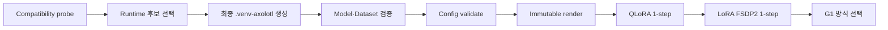

# 이 워크북의 목적

이 문서는 Mistral F5-X 학습을 자동으로 대신 실행하는 문서가 아니다. 사용자가
직접 명령을 실행하고, 화면과 로그를 읽고, 각 단계의 의미를 이해하며 다음 단계로
갈지를 결정하기 위한 실습 교재다.

대상 실험은 다음 두 가지 G1 1-step canary다.

1. `g1-qlora-ddp`: 4-bit QLoRA와 DDP
2. `g1-bf16-lora-fsdp2`: BF16 LoRA와 FSDP2

이 워크북을 끝내도 100-step 학습이나 모델 품질이 승인되는 것은 아니다. G1은
환경, 메모리, 분산 실행, adapter 저장이 실제로 동작하는지를 확인하는 단계다.

> 현재 중요 중단 조건: 기존 runtime manifest의 Axolotl pin은
> Transformers `5.14.1`을 요구하지만 기존 승인 Transformers commit은
> `5.15.0.dev0`이다. compatibility probe와 후보 검토가 끝나기 전에는 최종
> `.venv-axolotl` 설치를 진행하지 않는다.

## 현재 검증 상태 — 2026-08-09

| 항목 | 확인 결과 |
| --- | --- |
| B200 source sync | `PASS`; `workspace/AegisLM-B200-phase-f-source-v3`에 로컬 dirty 31개 파일 동기화, hash mismatch 0 |
| B200 기준 | branch `codex/phase-f-source-v3`, HEAD `cb520cdd132f86f23fc45a8800cb6c20c3ab9dc3` |
| Compatibility matrix | SHA-256 `47e2a8714d38e5b9cad3001a6bdad95fc6e0cd2599a51851618adbddc2007378` |
| Matrix 비실행 검사 | `validate`와 `plan` PASS; 세 후보와 격리된 probe 경로 확인 |
| B200 CPU 회귀 검사 | 대상 회귀 `48 passed`, 전체 pytest `470 passed` |
| Experiment config | `validate` PASS; SHA-256 `f5e8cd4be53cda6db55a886ddda12a967ceed68e84e6ec7ba0a4f167e28af07d` |
| GPU 식별 | NVIDIA B200 2장, 각 `183359 MiB` |
| 보호 경계 | `.runtime-probes/mistral-f5x`와 `.venv-axolotl` 미생성 |

## 수동 독립 프로젝트 경로 추가 — 2026-08-11

기존 F5-X 승인 계획은 Axolotl 배포 BF16 snapshot을 pin했다. 이후 별도 수동 실습
프로젝트에서는 공식 `mistralai/Mistral-Small-4-119B-2603` FP8 snapshot을 immutable
revision으로 받고, Mistral의 공식 descale 식으로 local BF16 checkpoint를 직접
생성했다. 이 경로는 기존 승인 pin을 소급 변경하지 않는 별도 실습 분기다.

FP8을 BF16으로 변환해도 양자화 전에 잃은 정밀도는 복원되지 않는다. 자세한 수학,
파일 구조와 독립 검증 gate는 [Mistral 공식 FP8 체크포인트의 로컬 BF16 변환 이해](../fundamentals/mistral_fp8_to_bf16_checkpoint_conversion.md)를 따른다. 새 local checkpoint를
실제 G1 config에 연결하려면 model source·revision·conversion manifest와 output inventory를
새 승인 기준으로 다시 동결해야 한다.

여기까지는 바로 다시 확인해도 된다. 다음 `2.2 실제 B200 probe`는 dependency를
다운로드하고 임시 환경을 만드는 별도 실행 단계다. 사용자가 그 작업을 시작하기
전까지 model·dataset 다운로드, symlink 생성과 G1 학습도 실행하지 않는다.

> 경로 주의: 기존 `workspace/AegisLM-B200`은 Qwen 작업용이다. Mistral F5-X
> 명령은 반드시 `workspace/AegisLM-B200-phase-f-source-v3`에서 실행한다.

# 사용 방법

- 위에서 아래로 한 단계씩 진행한다.
- 명령을 실행하기 전에 `학습 목표`와 `중단 조건`을 먼저 읽는다.
- 체크박스는 실제로 확인한 뒤에만 표시한다.
- hash, exit code, GPU 메모리, loss와 오류 메시지는 추측하지 않고 그대로 기록한다.
- API token과 password는 이 문서에 기록하지 않는다.
- `PASS`가 아닌 단계에서 다음 단계로 넘어가지 않는다.

# 전체 흐름



핵심은 `코드 작성 → 바로 장시간 학습`이 아니다. 작은 gate를 통과할 때마다 다음
위험만 하나씩 허용한다.

# 0. 먼저 알아둘 개념

| 용어 | 이 실험에서의 의미 |
| --- | --- |
| Base model | adapter를 붙이기 전 원본 학습 모델 |
| Tokenizer | 문자열을 model token ID로 바꾸고 chat template를 적용하는 도구 |
| LoRA | base weight를 고정하고 작은 저랭크 행렬만 학습하는 방식 |
| QLoRA | base model을 낮은 bit로 읽고 LoRA adapter를 학습해 VRAM을 줄이는 방식 |
| DDP | GPU마다 모델 복제본을 두고 gradient를 동기화하는 분산 방식 |
| FSDP2 | parameter·gradient·optimizer state를 GPU 사이에 shard하는 modern FSDP 방식 |
| Step | optimizer가 parameter를 한 번 갱신한 횟수 |
| 1-step canary | 성능 학습이 아니라 load·forward·backward·save 경로를 확인하는 최소 실험 |
| VRAM | GPU memory. 이 실험의 gate는 GPU당 peak `165 GiB` 이하 |
| OOM | Out Of Memory. GPU 또는 host memory 부족으로 실행이 중단된 상태 |
| Adapter | LoRA/QLoRA로 학습된 작은 weight 산출물 |
| Preflight | 학습 전에 환경·hash·tokenizer·dataset을 검사하는 절차 |
| Raw-byte hash | 파일을 해석한 값이 아니라 파일 byte 전체의 SHA-256 |
| Run ID | 한 번의 실행과 artifact directory를 구분하는 고유 ID |

## 왜 loss만 보면 안 되는가

1-step의 loss는 `NaN`이나 `inf`가 아닌지를 확인하는 신호다. loss가 낮아졌다는
사실만으로 보안 분석 품질이 좋아졌다고 결론 내릴 수 없다. 모델 품질은 이후의
blind 500건 절대평가에서 precision, recall, FPR, abstention, schema, safety와
evidence 기준으로 판단한다.

## Validation 1,000건은 어디에 쓰이는가

현재 G1 renderer는 `val_set_size: 0`, `eval_strategy: no`다. validation 1,000건은
Trainer의 step별 평가 loss를 계산하는 용도가 아니라, 실제 tokenizer와 chat
template로 전수 preflight를 수행하는 데 사용한다.

# 1. 실습 전 안전 규칙

다음 항목은 모든 단계에 적용한다.

- [ ] 기존 Qwen `.venv`에 Axolotl dependency를 설치하지 않는다.
- [ ] `--no-deps`로 resolver 충돌을 숨기지 않는다.
- [ ] dependency metadata를 직접 수정하지 않는다.
- [ ] `configs/experiment.yaml`의 model·dataset pin을 임의로 바꾸지 않는다.
- [ ] 기존 run directory를 지우거나 재사용하지 않는다.
- [ ] 실패한 run도 증거이므로 log와 marker를 보존한다.
- [ ] raw dataset, model weight, adapter, token을 Git에 추가하지 않는다.
- [ ] G3 PASS 전 merge, evidence adapter와 full epoch를 실행하지 않는다.

## 시작 가정

- AegisLM-B200 source가 B200 서버에 동기화돼 있다.
- 기존 Qwen/project 도구용 `.venv`와 `uv`가 이미 있다.
- Mistral 전용 `.venv-axolotl`은 아직 만들지 않았거나, 새 승인 runtime으로 만든
  검증된 환경이다.
- model·data·artifact의 persistent storage 경로는 운영자가 알고 있다.

## Local `.env` 준비

`.env`가 없을 때만 비밀이 없는 예시 파일에서 시작한다.

```bash
test -f .env || cp .env.example .env
chmod 600 .env
```

필요하면 선호하는 editor로 `.env`의 `HF_TOKEN`을 입력한다. token 값을 shell
화면, 이 워크북, Git diff나 채팅에 출력하지 않는다. `.env`가 Git ignore 상태인지
`git status --short`로 확인한다.

## 실행 세션 기록

| 항목                           | 직접 기록                                    |
| ---------------------------- | ---------------------------------------- |
| 시작 일시·timezone               |                                          |
| 운영자                          |                                          |
| 서버                           |                                          |
| repository path              | 비공개 경로는 로컬 기록에만 작성                       |
| Git branch                   |                                          |
| Git HEAD                     | cb520cdd132f86f23fc45a8800cb6c20c3ab9dc3 |
| compatibility matrix SHA-256 |                                          |
| runtime manifest SHA-256     |                                          |
| experiment config SHA-256    |                                          |
| active profile               |                                          |
| run ID                       |                                          |
| GPU 이름·개수                    |                                          |

기본 상태를 확인한다.

```bash
pwd
git status --short --branch
git rev-parse HEAD
nvidia-smi -L
df -h
```

확인할 것:

- [ ] 예상한 AegisLM-B200 repository다.
- [ ] GPU가 NVIDIA B200 2장이다.
- [ ] 다른 학습 process가 두 GPU를 점유하지 않는다.
- [ ] model과 artifact를 저장할 여유 공간이 있다.
- [ ] 기존 dirty 파일을 새 변경으로 오해하지 않도록 상태를 기록했다.

# 2. Compatibility matrix 이해하기

## 학습 목표

Python package는 버전 하나만 맞는다고 동작하지 않는다. Axolotl,
Transformers, PyTorch, CUDA, Flash Attention, bitsandbytes와 torchao가 하나의
조합으로 설치되고 import되어야 한다. 이 단계에서는 세 조합을 서로 분리된 임시
환경에서 검사한다.

| 후보 | 목적 | 최종 후보 가능 여부 |
| --- | --- | --- |
| `current-declared` | 현재 Axolotl commit과 그것이 선언한 Transformers 5.14.1 | probe 결과에 따라 가능 |
| `official-v0-17` | 공식 v0.17.0 commit과 선언된 Transformers 5.9.0 | probe 결과에 따라 가능 |
| `approved-negative-control` | 기존 승인 pin의 충돌을 실제 resolver가 잡는지 확인 | 항상 불가 |

negative control이 실패하는 것은 실험 실패가 아니다. 예상한 충돌을 resolver가
정직하게 감지했다는 통제 실험 결과다.

## 2.1 파일 검증과 실행 계획 확인

이 두 명령은 파일을 생성하지 않는다.

```bash
.venv/bin/python scripts/probe_mistral_f5x_compatibility.py \
  --matrix configs/runtime/mistral_f5x_compatibility_matrix.json \
  --action validate

.venv/bin/python scripts/probe_mistral_f5x_compatibility.py \
  --matrix configs/runtime/mistral_f5x_compatibility_matrix.json \
  --action plan
```

기대 결과:

- `validate`가 matrix SHA-256과 함께 PASS를 출력한다.
- `plan`에 세 candidate가 고정 순서로 나타난다.
- candidate마다 `uv venv` → `uv pip install` → `uv pip check` → runtime
  evidence 명령이 보인다.
- final `.venv-axolotl` 생성 명령은 없다.

기록:

| 항목 | 결과 |
| --- | --- |
| validate exit code |  |
| 출력 matrix SHA-256 |  |
| candidate 수와 순서 |  |
| 금지 옵션 발견 여부 |  |

## 2.2 실제 B200 probe

이 단계부터 dependency를 다운로드하고 임시 가상환경을 생성한다. 실행 전에
`configs/runtime/mistral_f5x_compatibility_matrix.json`의 raw hash를 직접 구한다.

```bash
export AEGISLM_APPROVED_COMPATIBILITY_MATRIX_SHA256="$(sha256sum configs/runtime/mistral_f5x_compatibility_matrix.json | cut -d' ' -f1)"

python scripts/probe_mistral_f5x_compatibility.py \
  --matrix configs/runtime/mistral_f5x_compatibility_matrix.json \
  --action probe
```

probe는 `.runtime-probes/mistral-f5x`를 새로 만든다. 해당 directory가 이미 있으면
재사용하거나 자동 삭제하지 않고 중단한다.

실행 중 관찰할 것:

- [ ] 각 candidate가 서로 다른 `environment`에 설치된다.
- [ ] resolver 오류를 무시하고 다음 명령으로 강행하지 않는다.
- [ ] `uv pip check` 결과가 evidence에 남는다.
- [ ] 두 B200 이름과 CUDA version이 기록된다.
- [ ] probe 전후 Qwen `.venv` fingerprint가 같다.

완료 후 inventory를 읽는다.

```bash
python -m json.tool .runtime-probes/mistral-f5x/inventory.json | less
```

| 항목 | 직접 기록 |
| --- | --- |
| `qwen_environment_unchanged` |  |
| `compatible_candidates` |  |
| current-declared 결과 |  |
| official-v0-17 결과 |  |
| negative-control 결과 |  |
| 실패한 command와 exit code |  |

### PASS 조건

- `qwen_environment_unchanged`가 `true`다.
- final-eligible candidate가 최소 하나 있다.
- 선택 후보의 install, `uv pip check`, package identity, imports, Mistral 4
  symbols, CUDA, B200 2장과 Axolotl CLI 검사가 모두 통과한다.
- negative control은 final candidate에 포함되지 않는다.

### 중단 조건

- Qwen `.venv` fingerprint가 달라졌다.
- 호환 후보가 하나도 없다.
- evidence가 누락되거나 candidate ID·matrix hash가 다르다.
- probe 중 기존 `.venv` 또는 `.venv-axolotl`이 변경됐다.

이 단계가 끝나면 inventory와 각 candidate `evidence.json`을 Sol에게 전달해 검토를
받는다. 호환 후보가 보인다는 이유만으로 runtime manifest를 직접 편집하지 않는다.

# 3. 최종 Mistral 환경 만들기

## 학습 목표

probe 환경은 비교를 위한 일회용 실험실이다. 실제 학습은 검토를 통과한 pin을 새
Work Order에서 runtime manifest에 동결한 뒤 `.venv-axolotl`에 재현한다.

> STOP: 현재 runtime manifest가 선택 후보에 맞게 새로 승인됐다는 기록이 없으면
> 아래 `install`을 실행하지 않는다.

## 3.1 Runtime contract 읽기

```bash
python scripts/setup_mistral_f5x_env.py --action validate
sha256sum configs/runtime/mistral_f5x_environment.json
```

출력에서 확인할 것:

- [ ] 선택한 Axolotl과 Transformers pin이 probe PASS 후보와 같다.
- [ ] Python은 3.12다.
- [ ] PyTorch는 2.12.1, CUDA backend는 cu130이다.
- [ ] 환경 경로는 `.venv-axolotl`이다.
- [ ] 설치 계획에 `--no-deps`가 없다.

## 3.2 배타적 설치

```bash
export AEGISLM_APPROVED_RUNTIME_SHA256="$(sha256sum configs/runtime/mistral_f5x_environment.json | cut -d' ' -f1)"
python scripts/setup_mistral_f5x_env.py --action install
```

설치 후 현재 shell에서 telemetry opt-out을 설정하고 검사한다.

```bash
export AXOLOTL_DO_NOT_TRACK=1
.venv-axolotl/bin/python scripts/check_mistral_f5x_runtime.py --require-gpus
```

| 항목 | 직접 기록 |
| --- | --- |
| Runtime manifest SHA-256 |  |
| `uv pip check` |  |
| Python |  |
| Torch |  |
| CUDA |  |
| Axolotl commit/version |  |
| Transformers commit/version |  |
| GPU 0 이름 |  |
| GPU 1 이름 |  |
| Axolotl CLI 경로 |  |

### 중단 조건

- `.venv-axolotl`이 설치 전에 이미 존재한다.
- resolver나 `uv pip check`가 실패한다.
- source commit evidence가 runtime manifest와 다르다.
- Axolotl CLI가 `.venv-axolotl` 밖에 있다.
- GPU가 2장이 아니거나 B200이 아니다.

# 4. Workspace와 저장 경계 준비

## 학습 목표

가상환경과 model/data/artifact 저장소는 서로 다른 문제다. model과 data는 persistent
root 전체를 연결하지만, `training_artifacts` 전체를 바꾸지 않고 Mistral 하위
namespace만 persistent storage에 연결한다. 이 경계는 기존 Qwen artifact를
보존하기 위한 것이다.

먼저 현재 상태를 읽는다.

```bash
ls -ld model data training_artifacts
ls -ld training_artifacts/mistral-small-4-119b 2>/dev/null || true
```

다음 환경변수에는 서버에서 승인한 실제 경로를 사용한다. 실제 경로는 Wiki나 Git에
기록하지 않는다.

```bash
export AEGISLM_PROJECT_ROOT="/path/to/AegisLM-B200"
export PERSISTENT_ROOT="/path/to/LLM"

.venv/bin/python scripts/setup_b200_workspace.py \
  --project-root "${AEGISLM_PROJECT_ROOT}" \
  --persistent-root "${PERSISTENT_ROOT}"
```

검증:

```bash
readlink -f model
readlink -f data
readlink -f training_artifacts/mistral-small-4-119b
```

- [ ] `model`은 persistent `Model` root를 가리킨다.
- [ ] `data`는 persistent `Data` root를 가리킨다.
- [ ] Mistral artifact 하위 경로만 persistent `TrainingArtifacts`를 가리킨다.
- [ ] 기존 Qwen local artifact 경로는 그대로다.

기존 non-symlink 경로나 다른 target이 있으면 script가 거부하는 것이 정상이다.
자동으로 삭제하거나 교체하지 말고 현재 경계를 먼저 확인한다.

# 5. Model snapshot 준비

## 학습 목표

model ID만 기록하면 같은 실험을 재현할 수 없다. 같은 repository에서도 revision과
파일 구성이 바뀔 수 있으므로 pinned revision과 전체 파일 inventory가 필요하다.

학습 모델:

- Repository: `axolotl-ai-co/Mistral-Small-4-119B-2603-BF16`
- Revision: `7918b06c0799750ce522f949bcc97dff2dca632a`
- Local path: `model/mistral-small-4-119b-2603-bf16`

## 5.1 다운로드 전 크기 확인

이 명령도 Hugging Face metadata를 조회하고 local/cache directory를 만들 수 있다.
실제 token은 local `.env`에서만 읽고 출력하거나 워크북에 복사하지 않는다.

```bash
set -a
. ./.env
set +a

.venv/bin/python scripts/download_hf_model.py \
  --variant mistral-small-4-119b-bf16 \
  --revision 7918b06c0799750ce522f949bcc97dff2dca632a \
  --dry-run-files
```

| 항목 | 직접 기록 |
| --- | --- |
| 예상 파일 수 |  |
| 예상 총 GiB |  |
| persistent free space |  |
| 승인한 최대 다운로드 GiB |  |

## 5.2 실제 다운로드

dry-run 결과를 확인한 뒤 승인한 상한을 직접 입력한다.

```bash
read -r -p "승인한 최대 다운로드 GiB: " MISTRAL_MAX_DOWNLOAD_GIB

.venv/bin/python scripts/download_hf_model.py \
  --variant mistral-small-4-119b-bf16 \
  --revision 7918b06c0799750ce522f949bcc97dff2dca632a \
  --max-download-gib "${MISTRAL_MAX_DOWNLOAD_GIB}"
```

다운로드 후 local snapshot을 검사한다.

```bash
.venv/bin/python scripts/download_hf_model.py \
  --variant mistral-small-4-119b-bf16 \
  --inspect-local

sha256sum model/mistral-small-4-119b-2603-bf16/aegislm_model_manifest.json
```

- [ ] 누락된 safetensors shard가 0개다.
- [ ] manifest resolved revision이 config의 training revision과 같다.
- [ ] `config.json`, `tokenizer_config.json`, `tokenizer.json`이 있다.
- [ ] 전체 파일 inventory SHA-256이 manifest에 기록됐다.

# 6. Dataset 준비와 이해

## 학습 목표

이 실험은 train 10,000건과 validation 1,000건을 사용한다. 단순히 파일이 있다는
것만 확인하지 않고 count, file hash, manifest hash와 prompt contract를 확인한다.

```bash
wc -l data/processed/phase-f-source-decision-v1/train.jsonl
wc -l data/processed/phase-f-source-decision-v1/validation.jsonl

sha256sum data/processed/phase-f-source-decision-v1/train.jsonl
sha256sum data/processed/phase-f-source-decision-v1/validation.jsonl
sha256sum data/processed/phase-f-source-decision-v1/dataset_manifest.json
```

기대값:

| 파일 | Count | SHA-256 |
| --- | ---: | --- |
| `train.jsonl` | 10,000 | `2d46c7d8161cbf97cc4efeb1a8c223311f4260ccf7a333dbe3cd71b73715f322` |
| `validation.jsonl` | 1,000 | `ab576d0332282244b68711f5fb7129c171cd0b95784f914cf5a7255e880d5481` |
| `dataset_manifest.json` | - | `b987d174657061b0d0cdf263f738025514abbd9e3bb054251ca7d9d1777daa4e` |

`run` 직전 runtime preflight는 각 row에 대해 다음을 다시 검사한다.

- JSON과 messages role 순서
- 고정 system prompt hash
- assistant target contract
- 실제 pinned tokenizer chat-template rendering
- `[THINK]`, `[/THINK]` marker 0건
- 2,048 token 초과 0건

tokenizer가 없으면 문자 수 추정으로 대신하지 않고 중단하는 것이 정상이다.

## 2026-08-18 전수 검사 실측 결과

```text
STEP 3-B PASS : all 11,000 dataset rows passed tokenizer preflight
```

| split | count | min | p50 | p95 | p99 | max | target min/max | over 2048 | THINK |
| --- | ---: | ---: | ---: | ---: | ---: | ---: | ---: | ---: | ---: |
| train | 10,000 | 254 | 381 | 830 | 927 | 1,505 | 7 / 10 | 0 | 0 |
| validation | 1,000 | 254 | 382 | 759 | 920 | 1,497 | 7 / 10 | 0 | 0 |

`present`와 `not_observed`는 train에서 각각 5,000건, validation에서 각각 500건으로
균형을 이뤘다. 전체 고유 ID 11,000개와 세 SHA-256 pin도 일치했다. 따라서 현재
dataset은 2,048-token 계약 안에서 Axolotl 설정 검증 단계로 이동할 수 있다.

첫 실행의 `train:1: empty target`은 실제 빈 label이 아니라 Transformers 5.x의
chat-template 반환 객체에서 `.input_ids`를 꺼내지 않은 helper 오류였다. 자세한
원인과 수정은 [Mistral 전수 Preflight의 잘못된 Empty Target 판정](../../../errors/mistral-preflight-empty-target-batchencoding.md)을 참고한다.

## Axolotl debug preprocess 주의

`axolotl preprocess ... --debug` 실행에서는 실효 `sequence_len`이 512로 출력되면서
10,000건 중 1,221건이 제외되고 8,779건짜리 cache가 만들어졌다. 명령 자체는 이
상태에서도 `Success!`를 출력하므로 성공 문자열만으로 학습용 cache를 승인하면 안 된다.

debug 출력에서는 assistant JSON token과 EOS만 실제 label ID를 유지하고 system·user
token은 `-100`으로 masking되어 assistant-only 학습 계약이 정상임을 확인했다. label
수 7 또는 10도 독립 tokenizer preflight와 일치했다.

학습용 전처리는 `--debug` 없이 다시 실행했다. 실효 `sequence_len: 2048`,
`min_input_len: 254`, `max_input_len: 1505`, 저장 row 10,000, exit code 0과
`Success!`를 확인했다. debug 8,779건 cache와 정상 10,000건 cache는 서로 다른 hash
하위 경로에 남았다. Axolotl이 기존 정상 cache를 찾지 못하고 재생성하는 현상은
데이터 정확성 문제가 아니라 성능·cache 재사용 문제로 분리해 관찰한다.

# 7. `configs/experiment.yaml` 공부하기

## 세 종류의 값

| 종류 | 예 | 수정 규칙 |
| --- | --- | --- |
| Immutable pin | model revision, dataset hash, seed, LoRA target | 새 Work Order 없이 수정 금지 |
| G1 선택값 | `active_profile`, `run_id`, `run_directory` | 한 run마다 새 값으로 승인 |
| Future gate | G2, G3, merge, full epoch | 현재 모두 false 유지 |

주의: `approvals` 아래의 boolean을 사용자가 임의로 `true`로 바꾸지 않는다. 현재
validator는 이 값을 frozen policy로 검사한다. 실제 dependency·download·GPU 승인은
Work Order와 raw-byte hash 절차로 관리한다.

## QLoRA에서 읽어야 할 값

```text
active_profile: g1-qlora-ddp
max_steps: 1
sequence_len: 2048
load_in_4bit: true
quantize_moe_experts: true
lora_dropout: 0.0
```

QLoRA는 FSDP와 DeepSpeed key가 없어야 한다. Axolotl의 multi-GPU 기본 경로로
DDP를 사용한다.

### 2026-08-18 QLoRA G1 실측 BLOCK

일반적인 1,024×1,024 BF16 tensor의 NF4 quantize/dequantize는 B200·CUDA 13.0과
bitsandbytes 0.49.1에서 finite 결과로 PASS했다. 그러나 Mistral의 fused
`gate_up_proj`는 `[128, 4096, 4096]`, 즉 정확히 2,147,483,648(`2^31`)개 원소였다.
이는 bitsandbytes CUDA kernel이 단일 tensor 크기로 받는 signed `int` 최대값보다
1 크다.

실제 2-GPU run은 `/src/csrc/ops.cu`의 `invalid argument`로 model quantization 중
종료됐다. 따라서 이 QLoRA run은 데이터·B200·CUDA 일반 호환성 문제가 아니라
upstream fused-tensor 크기 제한으로 `BLOCK`한다. 실패 output과 log는 보존하고
재사용하지 않는다. 자세한 증거는 [Mistral Fused Expert가 bitsandbytes INT_MAX를 초과해 QLoRA 실패](../../../errors/mistral-fused-expert-bitsandbytes-intmax-qlora.md)에 있다.

현재 워크북은 임의 chunk quantization patch를 적용하지 않고 다음 승인 profile인
BF16 LoRA + FSDP2 1-step으로 이동한다.

## LoRA에서 읽어야 할 값

```text
active_profile: g1-bf16-lora-fsdp2
max_steps: 1
bf16: true
fsdp_version: 2
transformer_layer_cls_to_wrap: Mistral4DecoderLayer
```

LoRA profile에는 4-bit quantization key가 없어야 한다. deprecated FSDP1 key나
DeepSpeed key도 없어야 한다.

## Run ID 규칙

- 영문 소문자, 숫자와 `-`만 사용한다.
- profile과 날짜, 순번을 알아볼 수 있게 만든다.
- `run_directory` 마지막 component는 run ID와 정확히 같아야 한다.
- 이미 존재하는 directory의 run ID를 재사용하지 않는다.

예시:

```text
g1-qlora-ddp-20260809-001
g1-bf16-lora-fsdp2-20260809-001
```

# 8. Validate와 Render

## `validate`란 무엇인가

YAML을 읽어 schema, immutable pin, path와 gate를 검사한다. run directory를 만들지
않으므로 여러 번 실행해도 된다.

```bash
.venv-axolotl/bin/python scripts/run_experiment.py \
  --config configs/experiment.yaml \
  --action validate
```

출력된 config SHA-256을 기록한다.

| 항목 | 직접 기록 |
| --- | --- |
| Profile |  |
| Run ID |  |
| Config SHA-256 |  |
| Validate exit code |  |

## `render`란 무엇인가

승인된 config를 새 run directory에 복사하고 Axolotl YAML과 inventory를 생성한다.
render 뒤 config byte가 바뀌면 해당 run은 실행할 수 없다.

```bash
export AEGISLM_APPROVED_CONFIG_SHA256="$(sha256sum configs/experiment.yaml | cut -d' ' -f1)"

.venv-axolotl/bin/python scripts/run_experiment.py \
  --config configs/experiment.yaml \
  --action render
```

render 전 확인:

- [ ] model, data, final runtime 준비가 모두 끝났다.
- [ ] run ID와 run directory가 새 값이다.
- [ ] 현재 config hash를 기록했다.
- [ ] 해당 run directory가 존재하지 않는다.

render 후 생성물:

```text
${RUN_DIRECTORY}/
├── approved-config.yaml
├── approved-config.sha256
├── axolotl.generated.yaml
├── inventory.json
└── logs/
```

config에서 run directory를 읽어 shell 변수로 설정한 뒤 생성물을 직접 확인한다.

```bash
export RUN_DIRECTORY="$(.venv-axolotl/bin/python -c 'import yaml; print(yaml.safe_load(open("configs/experiment.yaml", encoding="utf-8"))["artifacts"]["run_directory"])')"

find training_artifacts/mistral-small-4-119b -maxdepth 3 -type f -print
sed -n '1,240p' "${RUN_DIRECTORY}/axolotl.generated.yaml"
python -m json.tool "${RUN_DIRECTORY}/inventory.json"
```

위 명령은 `RUN_DIRECTORY`를 임의로 다시 입력하지 않고 승인 config에서 직접 읽는다.

학습과 monitor에 사용할 두 변수도 config에서 읽을 수 있다. 새 SSH terminal을 열면
각 terminal에서 이 두 줄을 다시 실행한다.

```bash
export RUN_ID="$(.venv-axolotl/bin/python -c 'import yaml; print(yaml.safe_load(open("configs/experiment.yaml", encoding="utf-8"))["experiment"]["run_id"])')"
export RUN_DIRECTORY="$(.venv-axolotl/bin/python -c 'import yaml; print(yaml.safe_load(open("configs/experiment.yaml", encoding="utf-8"))["artifacts"]["run_directory"])')"
printf 'RUN_ID=%s\nRUN_DIRECTORY=%s\n' "${RUN_ID}" "${RUN_DIRECTORY}"
```

QLoRA generated YAML 체크:

- [ ] `adapter: qlora`
- [ ] `load_in_4bit: true`
- [ ] `quantize_moe_experts: true`
- [ ] FSDP와 DeepSpeed key 없음

LoRA generated YAML 체크:

- [ ] `adapter: lora`
- [ ] `fsdp_version: 2`
- [ ] modern `fsdp_config` 존재
- [ ] quantization과 DeepSpeed key 없음

# 9. G1 QLoRA 1-step 직접 실행

## 학습 목표

119B model을 두 B200에서 실제로 load하고, 전수 preflight 뒤 forward, backward,
optimizer step과 adapter 저장이 완료되는지 확인한다.

## 9.1 실행 전 마지막 체크

```bash
nvidia-smi
pgrep -af 'axolotl|torchrun' || true
find "${RUN_DIRECTORY}/logs" -mindepth 1 -maxdepth 1 -print
sha256sum configs/experiment.yaml
```

- [ ] 두 GPU를 사용할 다른 학습 process가 없다.
- [ ] `logs/` 출력이 비어 있다.
- [ ] `run.started.json`이 없다.
- [ ] 현재 config hash가 render 때 승인한 hash와 같다.
- [ ] profile은 `g1-qlora-ddp`다.

## 9.2 GPU monitor 터미널

학습 터미널과 별도의 SSH 터미널에서 먼저 실행한다. 이 명령은 중지할 때까지 2초
간격으로 기록한다. 학습 종료 뒤 `Ctrl+C`로 끝낸다.

```bash
export RUN_ID="$(.venv-axolotl/bin/python -c 'import yaml; print(yaml.safe_load(open("configs/experiment.yaml", encoding="utf-8"))["experiment"]["run_id"])')"
export RUN_DIRECTORY="$(.venv-axolotl/bin/python -c 'import yaml; print(yaml.safe_load(open("configs/experiment.yaml", encoding="utf-8"))["artifacts"]["run_directory"])')"

nvidia-smi \
  --query-gpu=timestamp,index,name,memory.used,utilization.gpu \
  --format=csv \
  -l 2 | tee "/tmp/${RUN_ID}-gpu.csv"
```

## 9.3 학습 터미널

장시간 SSH 연결이 끊어질 가능성이 있으면 사용자가 관리하는 `tmux` session 안에서
실행한다. runner는 stdout과 stderr를 run directory의 새 log 파일로 보낸다.

```bash
export AXOLOTL_DO_NOT_TRACK=1
export AEGISLM_APPROVED_CONFIG_SHA256="$(sha256sum configs/experiment.yaml | cut -d' ' -f1)"

.venv-axolotl/bin/python scripts/run_experiment.py \
  --config configs/experiment.yaml \
  --action run

echo "training exit code: $?"
```

## 9.4 로그 관찰 터미널

runner가 `run.started.json`을 만든 뒤 다음 로그를 볼 수 있다.

```bash
tail -F \
  "${RUN_DIRECTORY}/logs/train.stdout.log" \
  "${RUN_DIRECTORY}/logs/train.stderr.log"
```

관찰 순서:

1. Runtime preflight: package·CUDA·B200 검증
2. Model inventory: local snapshot 파일 전수 hash
3. Dataset preflight: train 10,000건·validation 1,000건 tokenization
4. Model load: GPU memory가 크게 증가
5. Forward/backward: 두 GPU utilization 증가
6. 1-step log: finite loss와 learning rate
7. Final adapter save와 process 종료

## 9.5 실행 후 증거 보존

```bash
cp "/tmp/${RUN_ID}-gpu.csv" "${RUN_DIRECTORY}/logs/gpu.csv"

awk -F', ' 'NR > 1 { value=$4; gsub(/ MiB/, "", value); if (value+0 > peak[$2]) peak[$2]=value+0 } END { for (gpu in peak) printf "GPU %s peak: %d MiB\n", gpu, peak[gpu] }' \
  "${RUN_DIRECTORY}/logs/gpu.csv"

test -d "${RUN_DIRECTORY}/adapter" || { echo "adapter missing"; exit 1; }

find "${RUN_DIRECTORY}/adapter" -type f -print0 \
  | sort -z \
  | xargs -0 -r sha256sum \
  | tee "${RUN_DIRECTORY}/logs/adapter.sha256"

test -s "${RUN_DIRECTORY}/logs/adapter.sha256" || { echo "adapter inventory empty"; exit 1; }

grep -Eai 'loss|grad_norm|learning_rate|nan|infinity|out of memory|oom|error' \
  "${RUN_DIRECTORY}/logs/train.stdout.log" \
  "${RUN_DIRECTORY}/logs/train.stderr.log"
```

### QLoRA G1 판정표

| Gate | 결과 | 증거 |
| --- | --- | --- |
| Process exit code 0 |  |  |
| GPU 0 참여 |  |  |
| GPU 1 참여 |  |  |
| GPU 0 peak ≤168,960 MiB |  |  |
| GPU 1 peak ≤168,960 MiB |  |  |
| loss finite |  |  |
| OOM 없음 |  |  |
| adapter directory 존재 |  |  |
| adapter file SHA-256 inventory 존재 |  |  |
| forbidden marker 0 |  |  |
| sequence limit 초과 0 |  |  |

`165 GiB × 1,024 = 168,960 MiB`이므로 `nvidia-smi` CSV와 gate의 단위를 혼동하지
않는다.

실패했으면 같은 run directory를 다시 사용하지 않는다. config에 새 run ID와 새 run
directory를 지정하고 새 hash 승인과 render부터 다시 시작한다.

# 10. G1 BF16 LoRA FSDP2 1-step

QLoRA 결과를 보존한 뒤 별도의 run으로 수행한다.

## 변경할 값

`configs/experiment.yaml`에서 다음 세 값만 새 run에 맞게 변경한다.

1. `experiment.active_profile`: `g1-bf16-lora-fsdp2`
2. `experiment.run_id`: 새 LoRA run ID
3. `artifacts.run_directory`: 새 run ID와 일치하는 Mistral namespace

profile 내부 FSDP2 값, model revision, dataset hash, step 수를 바꾸지 않는다.

변경 뒤 처음부터 다시 수행한다.

```bash
.venv-axolotl/bin/python scripts/run_experiment.py \
  --config configs/experiment.yaml \
  --action validate

export AEGISLM_APPROVED_CONFIG_SHA256="$(sha256sum configs/experiment.yaml | cut -d' ' -f1)"

.venv-axolotl/bin/python scripts/run_experiment.py \
  --config configs/experiment.yaml \
  --action render

.venv-axolotl/bin/python scripts/run_experiment.py \
  --config configs/experiment.yaml \
  --action run
```

QLoRA와 같은 방식으로 GPU CSV, stdout/stderr, adapter inventory를 보존한다.

### LoRA FSDP2 G1 판정표

| Gate | 결과 | 증거 |
| --- | --- | --- |
| Process exit code 0 |  |  |
| GPU 0 참여 |  |  |
| GPU 1 참여 |  |  |
| GPU 0 peak ≤168,960 MiB |  |  |
| GPU 1 peak ≤168,960 MiB |  |  |
| loss finite |  |  |
| OOM 없음 |  |  |
| FSDP2 error 없음 |  |  |
| adapter 저장 성공 |  |  |
| adapter SHA-256 inventory 존재 |  |  |

### 2026-08-18 standalone BF16 LoRA FSDP2 G1 실측 PASS

별도 수동 프로젝트에서 local BF16 checkpoint와 Axolotl 0.17.0을 사용한
`g1-bf16-lora-fsdp2-20260818-002` 1-step이 완료됐다. rank 1 dataset log와 FSDP2
DTensor patch가 확인됐고, global batch의 두 sample에서 총 832 token, assistant target
17 token을 학습했다.

```text
loss: 0.1592
grad_norm: 5.937
train_runtime: 81.64 seconds
GPU 0 peak: 151,586 MiB
GPU 1 peak: 151,842 MiB
adapter_model.safetensors: 4,337,827,640 bytes
```

loss·gradient는 finite였고 두 GPU peak는 `168,960 MiB` gate 아래였다. root와
`checkpoint-1`에 adapter가 저장됐으며 최종 로그는 `Model successfully saved`로
끝났다. QLoRA는 upstream tensor-size 제한으로 BLOCK이고 LoRA가 위 gate를 통과했으므로
다음 방식은 BF16 LoRA + FSDP2로 선택한다.

전체 GPU CSV에서 GPU 0/1 평균 utilization은 각각 8.8%/92.1%로 비대칭이었다. 그러나
두 GPU의 peak memory가 256 MiB 차이로 거의 같아 model shard 배치 실패로 해석하지
않는다. 이 1-step run에는 rank 0의 CPU-efficient checkpoint load, FSDP2 full-state
broadcast, checkpoint-1 저장과 최종 저장 시간이 실제 Trainer runtime보다 크게 포함됐다.
`nvidia-smi` utilization은 NCCL collective 대기 kernel도 active로 계산할 수 있으므로
전체-run 평균만으로 유효 연산량을 판정하지 않는다. G2 10-step에서 학습 구간 비중을
늘리고 step별 loss와 timestamp GPU CSV를 함께 기록해 비대칭이 계속되는지 재검사한다.

# 11. QLoRA와 LoRA 중 무엇을 선택하는가

| QLoRA | LoRA | 결정 |
| --- | --- | --- |
| PASS | PASS | LoRA 우선 선택 |
| PASS | OOM·VRAM 초과·save 실패 | QLoRA 선택 |
| FAIL | PASS | LoRA 선택. QLoRA 실패 원인은 별도 기록 |
| FAIL | FAIL | 중단. G2로 진행하지 않음 |

선택 기준은 1-step loss의 크기가 아니다. 두 방식 모두 hardware/save gate를 통과한
경우 연구 계획에 따라 BF16 LoRA를 우선한다.

| 비교 항목 | QLoRA 기록 | LoRA 기록 |
| --- | --- | --- |
| Runtime candidate |  |  |
| Exit code |  |  |
| GPU 0 peak MiB |  |  |
| GPU 1 peak MiB |  |  |
| Step time |  |  |
| Final loss |  |  |
| Adapter size |  |  |
| Save 성공 |  |  |
| 특이 로그 |  |  |

# 12. 자주 만나는 실패와 해석

| 증상 | 의미 | 다음 행동 |
| --- | --- | --- |
| Resolver conflict | package metadata가 양립하지 않음 | pin을 강제하지 말고 candidate evidence로 기록 |
| `uv pip check` 실패 | 설치는 됐지만 dependency contract가 깨짐 | 해당 runtime을 사용하지 않음 |
| Config hash mismatch | render/run 승인 뒤 YAML byte가 바뀜 | 변경 이유를 확인하고 새 hash·run으로 시작 |
| Run directory exists | 동일 실험 덮어쓰기 위험 | directory를 지우지 말고 새 run ID 사용 |
| Logs already exist | 이미 실행이 시작됐거나 증거가 있음 | 새 run ID 사용 |
| Tokenizer load 실패 | pinned local tokenizer가 없거나 snapshot 불완전 | model inventory와 revision 재검증 |
| Dataset hash mismatch | 입력 데이터가 승인본과 다름 | 학습 중단, 파일 출처 확인 |
| `[THINK]` 발견 | reasoning marker가 학습 prompt에 노출됨 | 해당 dataset을 사용하지 않음 |
| 2,048 token 초과 | sequence contract 위반 | 임의 truncate하지 말고 dataset gate로 복귀 |
| GPU 한 장만 사용 | torchrun/DDP/FSDP2 참여 실패 | process와 launcher log 확인 |
| OOM | 현재 profile이 memory gate를 통과하지 못함 | 값을 즉흥 변경하지 말고 실패 증거 보존 |
| loss `NaN`/`inf` | 수치적으로 유효한 update가 아님 | 즉시 중단하고 runtime/data 원인 조사 |
| Adapter 없음 | save lifecycle 실패 | G1 FAIL. 다음 step으로 진행 금지 |

# 13. 실험 일지

## 실행 중 메모

| 시각 | 단계 | 관찰 | 내가 이해한 원인 | 확인할 질문 |
| --- | --- | --- | --- | --- |
|  |  |  |  |  |
|  |  |  |  |  |
|  |  |  |  |  |

## 오류 기록

| 항목 | 내용 |
| --- | --- |
| 실패 단계 |  |
| 최초 오류 한 줄 |  |
| 전체 log 경로 |  |
| Exit code |  |
| GPU 상태 |  |
| Config SHA-256 |  |
| Runtime manifest SHA-256 |  |
| 재시도 여부 |  |
| 새 run ID |  |

## 학습 후 스스로 답해보기

1. 왜 Qwen `.venv`와 Mistral `.venv-axolotl`을 분리했는가?
2. 왜 YAML 내용을 복사해 두는 것만으로는 부족하고 raw-byte hash가 필요한가?
3. 왜 `render` 후 config를 수정하면 같은 run을 실행할 수 없는가?
4. QLoRA가 VRAM을 줄이는 대신 추가하는 계산·정확도 trade-off는 무엇인가?
5. DDP와 FSDP2는 model state를 GPU에 배치하는 방식이 어떻게 다른가?
6. 1-step loss가 finite여도 모델 품질 PASS가 아닌 이유는 무엇인가?
7. validation 1,000건이 현재 G1에서 Trainer evaluation이 아닌 이유는 무엇인가?
8. 실패한 run directory를 지우지 않는 것이 재현성에 어떤 도움을 주는가?

# 14. Sol에게 전달할 최소 evidence 묶음

다음 항목을 전달하면 환경이나 결과를 추측하지 않고 검토할 수 있다.

- Compatibility `inventory.json`과 candidate별 `evidence.json`
- Runtime manifest 경로와 SHA-256
- Experiment config SHA-256
- `approved-config.yaml`, `axolotl.generated.yaml`, run `inventory.json`
- `preflight.runtime.json`
- `run.started.json`
- `train.stdout.log`, `train.stderr.log`
- 두 GPU의 timestamp별 memory/utilization CSV
- Adapter file SHA-256 inventory
- Exit code와 사용자가 작성한 G1 판정표

raw model weight, raw dataset, token과 private server path는 전달 문서에 복사하지
않는다.

# 15. G1 이후

G1에서 방식이 선택되면 바로 100-step으로 가지 않는다.

1. 새 Work Order와 새 config로 선택 방식의 G2 10-step을 실행한다.
2. Adapter를 저장한다.
3. 새 process에서 reload한다.
4. 단일 inference로 load/save lifecycle을 검증한다.
5. G2 PASS 뒤에만 G3 100-step과 blind 500건 절대평가를 실행한다.

### 2026-08-18 standalone G2 10-step 학습 결과

`g2-bf16-lora-fsdp2-20260818-001`은 BF16 LoRA + FSDP2로 10-step을 완료했다.
step별 loss 10개는 모두 finite였고 최종 `train_loss`는 0.1523이었다.

```text
loss: 0.1592, 0.5566, 0.3447, 0.08929, 0.1096
      0.1289, 0.04529, 0.05817, 0.001171, 0.02975
train_runtime: 100.3 seconds
train_steps_per_second: 0.1
GPU 0/1 compute utilization: 99-100% during forward/backward
observed peak: 155,688/155,944 MiB
```

두 GPU peak는 165 GiB gate 아래였고 실제 학습 구간에는 양쪽이 동시에 99-100%로
동작했다. 초기 CPU-efficient load/full-state broadcast와 checkpoint·final save에서만
GPU 1의 utilization이 높고 GPU 0은 낮았다. 따라서 G1 전체-run의 8.8%/92.1% 평균은
rank 참여 실패가 아니라 load/save phase와 짧은 1-step의 비율 때문에 생긴 관측
왜곡으로 확정한다.

root와 `checkpoint-10`에 각각 4,337,827,640-byte `adapter_model.safetensors`가
저장됐다. checkpoint에는 약 8.68 GB optimizer state와 약 2.17 GB FSDP state도
보존됐다. 이 결과는 G2의 **학습·저장 단계 PASS**이며, 전체 G2 PASS에는 artifact
SHA-256 inventory와 새 process adapter reload·단일 inference가 남아 있다.

2026-08-19 사용자가 새 terminal command로 local BF16 base와 최종 adapter를 다시
읽고 비어 있지 않은 generation 및 `G2 RELOAD + INFERENCE TECHNICAL PASS` 출력을
확인했다. shell wrapper의 별도 permission 문제는 model lifecycle과 무관한 실행 편의
문제로 분리했다. SHA-256 inventory 파일과 reload log가 존재하는지 G3 시작 직전 다시
검사하며, 둘이 있으면 G2 전체를 PASS로 닫는다.

초기 직접 실행의 terminal output이 파일에 남지 않아 같은 final adapter를 새 process로
한 번 더 reload했다. 새 evidence log에는 `G2 RELOAD + INFERENCE TECHNICAL PASS`와
`reload exit code: 0`이 모두 기록됐고 기존 SHA-256 inventory도 PASS했다. 따라서 G2는
학습, 저장, inventory, reload와 단일 inference 전 항목 **PASS**로 확정한다.

사용자는 이어서 G3 100-step 실행을 명시적으로 승인했다. 새 run ID와 config hash를
사용하고 G2 output을 재사용하지 않는다. 100-step adapter 저장 뒤 기존 blind 500건
절대평가를 수행하며 loss 감소 자체는 품질 판정 기준으로 사용하지 않는다.

2026-08-20 blind 평가 preflight에서
`phase-f-source-fresh-blind-500-v1`과 그 decision contract의 challenge/gold가 각각
500행이고 challenge ID가 500개 모두 고유함을 확인했다. 두 challenge는
`system → user` 두 message만 가지며 assistant target이나 gold를 model input에
포함하지 않는다. source와 contract의 `SHA256SUMS`는 모든 항목이 일치했다.

standalone 프로젝트의 `scripts/blind500_check.sh`는 dataset·script 경로를 찾는
discovery 명령뿐이며 prediction generator나 scorer가 아니다. 따라서 이 파일을 평가기로
오인해 실행하지 않고, challenge-only prediction을 먼저 동결한 뒤 별도 process에서 기존
source-decision evaluator가 gold를 여는 두 단계로 수행한다.

G3 100-step은 loss log 100개, runtime 271.3초, 최종 train loss 0.04073으로
완료됐고 final adapter 저장과 SHA-256 inventory가 PASS했다. sibling
`AegisLM-B200-phase-f-source-v3`의 `evaluate_source_decision.py`와 내부 evaluation
library가 존재하며 standalone uv runtime에서 `--help` import smoke도 통과했다. 따라서
prediction은 Mistral standalone process가 만들고 scoring만 기존 evaluator를 읽기 전용으로
호출한다.

challenge-only generator가 G3 adapter로 prediction 500건을 생성했고 최종
`predictions.jsonl`의 행 수 500과 별도 SHA-256 checksum 검증이 PASS했다. 이후 발생한
`grep: : No such file or directory`는 새 shell에서 `PREDICT_LOG` 변수를 다시 선언하지
않아 빈 경로를 전달한 증거 조회 오류이며 prediction artifact와 무관하다. prediction이
hash로 동결됐으므로 이 시점 이후 별도 scorer process가 decision gold를 열 수 있다.

기존 source-decision evaluator를 final threshold로 실행한 결과 scorer exit code 0,
overall PASS였다. TP/TN/FP/FN은 `250/250/0/0`, precision/recall/schema/parse는
모두 1.0, FPR·abstention·누락·추가는 모두 0이었다. latency p50/p95는
2,395.3907/3,354.4281 ms다. 상세 판정과 hash는
[Mistral Small 4 119B G3 Blind 500 Source Decision PASS](mistral_small_4_119b_g3_blind500_decision_20260820.md)에 동결했다.

G3 PASS 전 merge, evidence adapter와 full epoch는 계속 금지한다. G3 PASS 뒤에도
이 작업들은 자동 후속 단계가 아니라 별도 연구 결정과 승인 대상이다.

# Related Concepts

- [Mistral Small 4 B200 vLLM 0.26 서빙 트러블슈팅](../../../errors/mistral-small4-b200-vllm-serving-troubleshooting-20260820.md)
- [Mistral F5-X 통합 설정 v2 인계서](../handoffs/mistral_f5x_unified_config_v2_handoff_20260805.md)
- [Fine-Tuning Fundamentals](../fundamentals/index.md)
- [AegisLM Phase F 연구 계획](aegislm_phase_f_experiment_plan_20260728.md)
- [LLM 생명주기 환경 설계](../../../infra/llm-lifecycle-environment-design.md)
- [B200 2-GPU Setup](../repos/AegisLM-B200/docs/operations/b200/B200_2GPU_SETUP.md)
- [AegisLM 수동 파인튜닝 검증 워크북](../repos/AegisLM-B200/docs/operations/b200/FINETUNING_TEST_WORKBOOK.md)

# Citations

- 실험 설정 정본: `configs/experiment.yaml`
- Runtime 후보 정본: `configs/runtime/mistral_f5x_compatibility_matrix.json`
- Runtime 정본: `configs/runtime/mistral_f5x_environment.json`
- 실행 정본: `scripts/run_experiment.py`
